# hillsong Design System

You are building UI for **hillsong**. Dark-themed, neutral palette, sans-serif typography (hillsong-icons), compact density on a 4px grid, expressive motion.

## Visual Reference

**IMPORTANT**: Study ALL screenshots below before writing any UI. Match colors, typography, spacing, layout, and motion exactly as shown.

### Homepage


### Scroll Journey (Cinematic Visual States)

> These screenshots capture the website at different scroll depths. The design changes dramatically as you scroll — each frame shows a different cinematic state. Replicate these exact visual transitions.

#### 0% — Hero / Above the fold

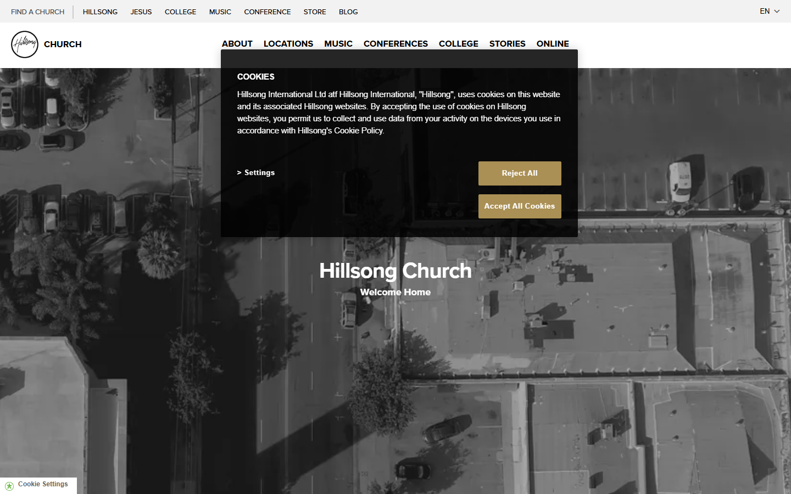

#### 17% — Mid-page at 17% scroll

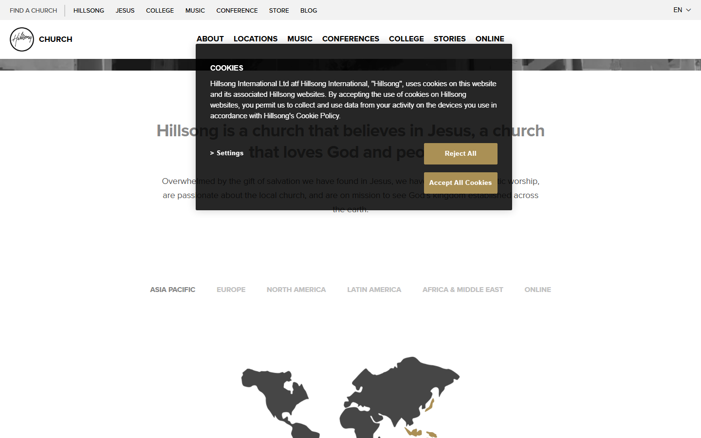

#### 33% — Mid-page at 33% scroll

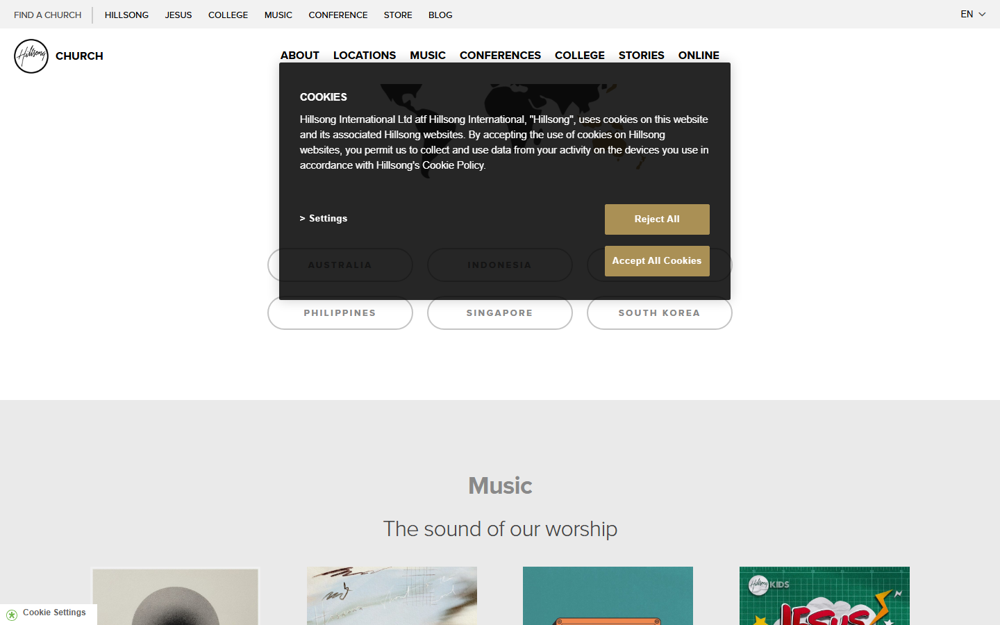

#### 50% — Mid-page at 50% scroll

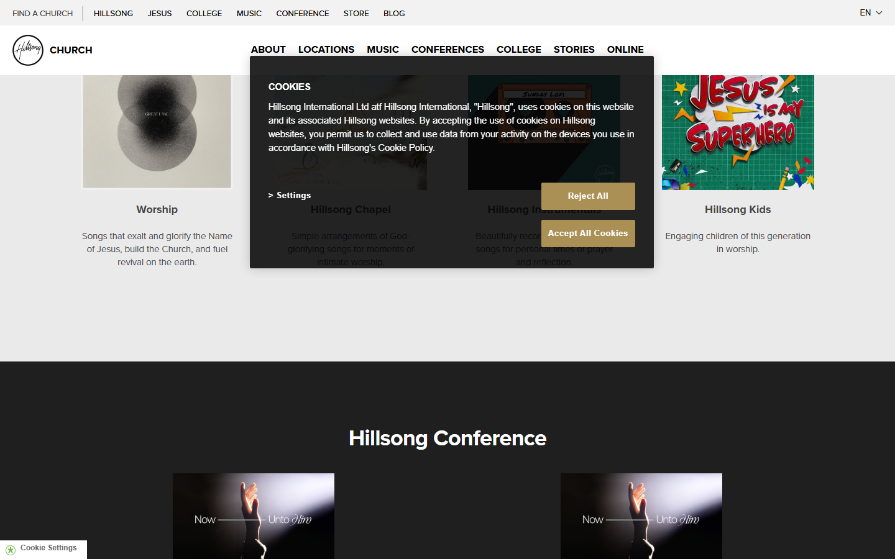

#### 67% — Mid-page at 67% scroll


#### 83% — Mid-page at 83% scroll

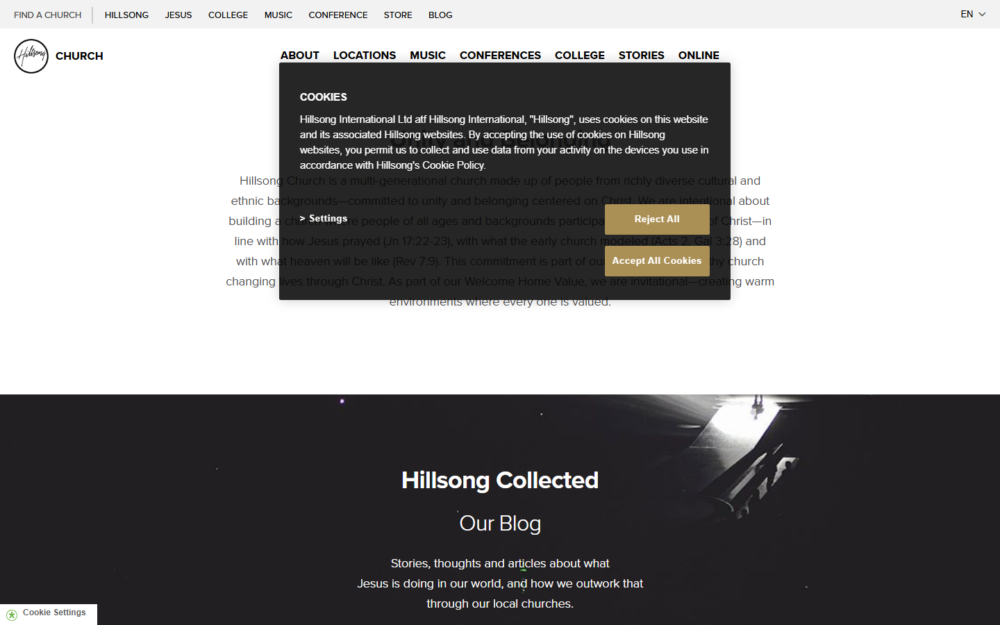

#### 100% — Footer / End of page

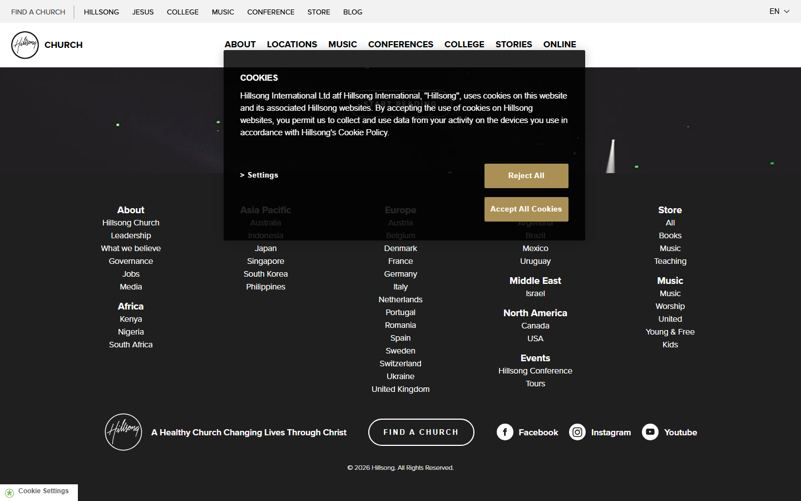

### Video Backgrounds (First Frames)

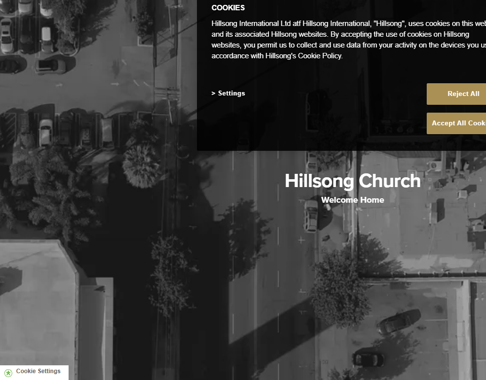

> Read `references/DESIGN.md` for full token details. Read `references/ANIMATIONS.md` for motion specs. Read `references/LAYOUT.md` for layout structure. Read `references/COMPONENTS.md` for component patterns.

## Ultra Reference Files

This package includes extended documentation. **Read these files before implementing:**

| File | Contents |
|------|----------|
| `references/DESIGN.md` | Full design system tokens, colors, typography, spacing |
| `references/VISUAL_GUIDE.md` | **START HERE** — Master visual guide with all screenshots embedded |
| `references/ANIMATIONS.md` | CSS keyframes, scroll triggers, motion library stack, video specs |
| `references/LAYOUT.md` | Flex/grid containers, page structure, spacing relationships |
| `references/COMPONENTS.md` | DOM component patterns, HTML structure, class fingerprints |
| `references/INTERACTIONS.md` | Hover/focus states with before/after style diffs |
| `screens/scroll/` | 7 scroll journey screenshots showing cinematic states |

## Design Philosophy

- **Layered depth** — use shadow tokens to create a sense of physical layering. Each elevation level has a specific shadow.
- **Gradient accents** — gradients are used thoughtfully for emphasis, not decoration.
- **Type pairing** — hillsong-icons for body/UI text, hillsongv2 for headings/display. Never introduce a third typeface.
- **compact density** — 4px base grid. Every dimension is a multiple of 4.
- **neutral palette** — the color temperature runs neutral, matching the sans-serif typography.
- **Expressive motion** — animations are an integral part of the experience. Use spring physics and layout animations.

## Color System

### Core Palette

| Role | Token | Hex | Use |
|------|-------|-----|-----|
| Background | `--background` | `#000000` | Page/app background |
| Surface | `--surface` | `#0d112f` | Cards, panels, modals |
| Text Primary | `--text-primary` | `#ffffff` | Headings, body text |
| Text Muted | `--text-muted` | `#464646` | Captions, placeholders |
| Border | `--border` | `#585858` | Dividers, card borders |

### Status Colors

| Status | Hex | Use |
|--------|-----|-----|
| Success | `#1bc48d` | Confirmations, positive trends |
| Warning | `#aa9055` | Caution states, pending items |

### Extended Palette

- **color-gray-700:** `#393b59`
- `#898989`
- `#666666`
- **color-red-50:** `#f2f2f2` — Light surface or highlight color
- `#c3aa92`
- `#289fd8`
- **wp-editor-canvas-background:** `#d7d7d7`
- `#111111` — Deep background layer or shadow color

### CSS Variable Tokens

```css
--wp-editor-canvas-background: #ddd;
--wp-admin-border-width-focus: 2px;
--wp-admin-border-width-focus: 1.5px;
--wp-editor-canvas-background: #ddd;
--wp-admin-border-width-focus: 2px;
--wp-admin-border-width-focus: 1.5px;
--wp-editor-canvas-background: #ddd;
--wp-admin-border-width-focus: 2px;
--wp-admin-border-width-focus: 1.5px;
--background: #000;
--foreground: #fff;
--accent: var(--foreground);
--carousel-card-width: 8.5rem;
--carousel-resource-card-width: calc(var(--carousel-card-width)*.8);
--carousel-card-width: 10.625rem;
--background: #ffffff;
--foreground: #000000;
--accent: #000000;
--wp-editor-canvas-background: #ddd;
--wp-admin-border-width-focus: 2px;
```

## Typography

### Font Stack

- **hillsong-icons** — Heading 1, Heading 2, Heading 3
- **hillsongv2** — Body, Caption
- **SFMono-Regular** — Code

### Font Sources

```css
@font-face {
  font-family: "hillsongv2";
  src: url("fonts/hillsongv2-Regular.ttf") format("truetype");
  font-weight: 400;
}
@font-face {
  font-family: "hillsong-icons";
  src: url("fonts/hillsong-icons-Regular.woff") format("woff");
  font-weight: 400;
}
@font-face {
  font-family: "proxima-nova";
  src: url("fonts/proxima-nova-700.ttf") format("woff2");
  font-weight: 700;
}
@font-face {
  font-family: "proxima-nova";
  src: url("fonts/proxima-nova-Regular.ttf") format("woff2");
  font-weight: 400;
}
@font-face {
  font-family: "Inter";
  src: url("fonts/Inter-Bold.ttf") format("truetype");
  font-weight: 700;
}
@font-face {
  font-family: "Inter";
  src: url("fonts/Inter-Regular.ttf") format("truetype");
  font-weight: 400;
}
@font-face {
  font-family: "AvenirLTPro-Light";
  src: url("fonts/AvenirLTPro-Light-Regular.woff2") format("woff2");
  font-weight: 400;
}
@font-face {
  font-family: "AvenirLTPro-LightOblique";
  src: url("fonts/AvenirLTPro-LightOblique-Regular.woff2") format("woff2");
  font-weight: 400;
}
@font-face {
  font-family: "AvenirLTPro-Book";
  src: url("fonts/AvenirLTPro-Book-Regular.woff2") format("woff2");
  font-weight: 400;
}
@font-face {
  font-family: "AvenirLTPro-BookOblique";
  src: url("fonts/AvenirLTPro-BookOblique-Regular.woff2") format("woff2");
  font-weight: 400;
}
@font-face {
  font-family: "AvenirLTPro-Roman";
  src: url("fonts/AvenirLTPro-Roman-Regular.woff2") format("woff2");
  font-weight: 400;
}
@font-face {
  font-family: "AvenirLTPro-Oblique";
  src: url("fonts/AvenirLTPro-Oblique-Regular.woff2") format("woff2");
  font-weight: 400;
}
@font-face {
  font-family: "AvenirLTPro-Medium";
  src: url("fonts/AvenirLTPro-Medium-Regular.woff2") format("woff2");
  font-weight: 400;
}
@font-face {
  font-family: "AvenirLTPro-MediumOblique";
  src: url("fonts/AvenirLTPro-MediumOblique-Regular.woff2") format("woff2");
  font-weight: 400;
}
@font-face {
  font-family: "AvenirLTPro-Heavy";
  src: url("fonts/AvenirLTPro-Heavy-Regular.woff2") format("woff2");
  font-weight: 400;
}
@font-face {
  font-family: "AvenirLTPro-HeavyOblique";
  src: url("fonts/AvenirLTPro-HeavyOblique-Regular.woff2") format("woff2");
  font-weight: 400;
}
@font-face {
  font-family: "AvenirLTPro-Black";
  src: url("fonts/AvenirLTPro-Black-Regular.woff2") format("woff2");
  font-weight: 400;
}
@font-face {
  font-family: "AvenirLTPro-BlackOblique";
  src: url("fonts/AvenirLTPro-BlackOblique-Regular.woff2") format("woff2");
  font-weight: 400;
}
@font-face {
  font-family: "inter";
  src: url("fonts/inter-100.woff2") format("woff2");
  font-weight: 100;
}
@font-face {
  font-family: "georgia";
  src: url("https://hillsong.com/app/themes/hillsong/webfonts/georgia.woff") format("woff");
  font-weight: 400;
}
```

### Type Scale

| Role | Family | Size | Weight |
|------|--------|------|--------|
| Heading 1 | hillsong-icons | 100px | 700 |
| Heading 2 | hillsong-icons | 75px | 700 |
| Heading 3 | hillsong-icons | 65px | 700 |
| Body | hillsongv2 | 12px | 400 |
| Caption | hillsongv2 | 16px | 400 |
| Code | SFMono-Regular | 14px | 400 |

### Typography Rules

- Body/UI: **hillsong-icons**, Headings: **hillsongv2** — these are the only display fonts
- Max 3-4 font sizes per screen
- Headings: weight 600-700, body: weight 400
- Use color and opacity for text hierarchy, not additional font sizes
- Line height: 1.5 for body, 1.2 for headings

## Spacing & Layout

### Base Grid: 4px

Every dimension (margin, padding, gap, width, height) must be a multiple of **4px**.

### Spacing Scale

`2, 4, 6, 8, 10, 12, 14, 16, 18, 20, 22, 24` px

### Spacing as Meaning

| Spacing | Use |
|---------|-----|
| 4-8px | Tight: related items (icon + label, avatar + name) |
| 12-16px | Medium: between groups within a section |
| 24-32px | Wide: between distinct sections |
| 48px+ | Vast: major page section breaks |

### Border Radius

Scale: `0px 0px 8px 8px, .1em, .25rem, .375rem, .5rem, .75rem, 1px, 1.5em, 2px, 2em, 2rem, 2.5px, 3px, 4px, 5px, 7px, 8px, 9px, 10px, 12px, 14px, 16px, 17px, 20px, 24px, 25px, 30px, 50px, 100%, inherit, 100px`
Default: `7px`

### Container

Max-width: `1198px`, centered with auto margins.

### Breakpoints

| Name | Value |
|------|-------|
| sm | 40rem |
| md | 48rem |
| lg | 64rem |
| xl | 80rem |
| 2xl | 96rem |
| xs | 320px |
| xs | 350px |
| xs | 420px |
| xs | 450px |
| sm | 500px |
| sm | 510px |
| sm | 545px |
| sm | 560px |
| sm | 561px |
| sm | 599px |
| sm | 600px |
| sm | 639px |
| sm | 640px |
| md | 766px |
| md | 767px |
| md | 768px |
| lg | 769px |
| lg | 770px |
| lg | 781px |
| lg | 782px |
| lg | 790px |
| lg | 800px |
| lg | 900px |
| lg | 937px |
| lg | 978px |
| lg | 979px |
| xl | 1198px |
| xl | 1199px |
| 2xl | 1600px |
| 2xl | 1680px |
| 2xl | 1800px |
| 2xl | 1900px |
| 2xl | 2400px |

Mobile-first: design for small screens, layer on responsive overrides.

## Component Patterns

### Card

```css
.card {
  background: #0d112f;
  border: 1px solid #585858;
  border-radius: 7px;
  padding: 16px;
  box-shadow: 0 0 3px rgba(0,0,0,.1);
}
```

```html
<div class="card">
  <h3>Card Title</h3>
  <p>Card content goes here.</p>
</div>
```

### Button

```css
/* Primary */
.btn-primary {
  background: #444444;
  color: #ffffff;
  border-radius: 7px;
  padding: 8px 16px;
  font-weight: 500;
  transition: opacity 150ms ease;
}
.btn-primary:hover { opacity: 0.9; }

/* Ghost */
.btn-ghost {
  background: transparent;
  border: 1px solid #585858;
  color: #ffffff;
  border-radius: 7px;
  padding: 8px 16px;
}
```

```html
<button class="btn-primary">Get Started</button>
<button class="btn-ghost">Learn More</button>
```

### Input

```css
.input {
  background: #000000;
  border: 1px solid #585858;
  border-radius: 7px;
  padding: 8px 12px;
  color: #ffffff;
  font-size: 14px;
}
.input:focus { border-color: var(--accent); outline: none; }
```

```html
<input class="input" type="text" placeholder="Search..." />
```

### Badge / Chip

```css
.badge {
  display: inline-flex;
  align-items: center;
  padding: 4px 8px;
  border-radius: 9999px;
  font-size: 12px;
  font-weight: 500;
  background: #0d112f;
  color: #464646;
}
```

```html
<span class="badge">New</span>
<span class="badge">Beta</span>
```

### Modal / Dialog

```css
.modal-backdrop { background: rgba(0, 0, 0, 0.6); }
.modal {
  background: #0d112f;
  border: 1px solid #585858;
  border-radius: 100px;
  padding: 24px;
  max-width: 480px;
  width: 90vw;
  box-shadow: #0000005c 0 0 10px 2px;
}
```

```html
<div class="modal-backdrop">
  <div class="modal">
    <h2>Dialog Title</h2>
    <p>Dialog content.</p>
    <button class="btn-primary">Confirm</button>
    <button class="btn-ghost">Cancel</button>
  </div>
</div>
```

### Table

```css
.table { width: 100%; border-collapse: collapse; }
.table th {
  text-align: left;
  padding: 8px 12px;
  font-weight: 500;
  font-size: 12px;
  color: #464646;
  text-transform: uppercase;
  letter-spacing: 0.05em;
  border-bottom: 1px solid #585858;
}
.table td {
  padding: 12px;
  border-bottom: 1px solid #585858;
}
```

```html
<table class="table">
  <thead><tr><th>Name</th><th>Status</th><th>Date</th></tr></thead>
  <tbody>
    <tr><td>Item One</td><td>Active</td><td>Jan 1</td></tr>
    <tr><td>Item Two</td><td>Pending</td><td>Jan 2</td></tr>
  </tbody>
</table>
```

### Navigation

```css
.nav {
  display: flex;
  align-items: center;
  gap: 8px;
  padding: 12px 16px;
  border-bottom: 1px solid #585858;
}
.nav-link {
  color: #464646;
  padding: 8px 12px;
  border-radius: 7px;
  transition: color 150ms;
}
.nav-link:hover { color: #ffffff; }
```

```html
<nav class="nav">
  <a href="/" class="nav-link active">Home</a>
  <a href="/about" class="nav-link">About</a>
  <a href="/pricing" class="nav-link">Pricing</a>
  <button class="btn-primary" style="margin-left: auto">Get Started</button>
</nav>
```

### Extracted Components

These components were found in the codebase:

**Button** (`html`)
- Variants: `color)`, `bg)`

**Card** (`html`)
- Variants: `-template`, `row`

**List** (`html`)

## Page Structure

The following page sections were detected:

- **Navigation** — Top navigation bar
- **Hero** — Hero section (detected from heading structure)
- **Faq** — FAQ/accordion section
- **Footer** — Page footer with links and info (3 items)
- **Testimonials** — Testimonials/reviews section
- **Cards** — Grid of 5 card elements (5 items)
- **Hero** — Hero/banner section with headline and CTAs
- **Cta** — Call-to-action section
- **Features** — Feature/benefit cards grid (2 items)

When building pages, follow this section order and structure.

## Animation & Motion

This project uses **expressive motion**. Animations are part of the design language.

### CSS Animations

- `fadeup`
- `fadein`
- `load8`
- `ball-spin-fade-loader`
- `promoslideinfromleft`

### Motion Tokens

- **Duration scale:** `0s`, `0ms`, `.15s`, `.2s`, `.3s`, `80ms`, `100ms`, `180ms`, `200ms`, `250ms`, `300ms`, `350ms`, `400ms`, `500ms`, `600ms`, `800ms`, `1000ms`
- **Easing functions:** `ease-in-out`, `linear`, `ease-in`, `ease-out`, `cubic-bezier(.2,.8,.2,1)`, `ease`, `cubic-bezier(.4,0,.2,1)`, `cubic-bezier(.22,1,.36,1)`

### Motion Guidelines

- **Duration:** Use values from the duration scale above. Short (0s) for micro-interactions, long (1000ms) for page transitions
- **Easing:** Use `ease-in-out` as the default easing curve
- **Direction:** Elements enter from bottom/right, exit to top/left
- **Reduced motion:** Always respect `prefers-reduced-motion` — disable animations when set

## Depth & Elevation

### Shadow Tokens

- Subtle: `0 0 0 2px rgba(0,0,0,.1)`
- Subtle: `0 0 0 2px ButtonText`
- Subtle: `0 0 2px 2px #0096ff`
- Subtle: `0 1px 2px rgba(0,0,0,.1)`
- Subtle: `rgb(102, 102, 102) 0px 0px 0px 0px`
- Raised (cards, buttons): `0 0 3px rgba(0,0,0,.1)`

### Z-Index Scale

`0, 1, 2, 5, 10, 20, 50, 100, 200, 300, 400, 420, 430, 450, 500, 520, 550, 560, 800, 900, 999, 1000, 1200, 4001, 4100, 4200, 4201, 8999, 9000, 9990, 9995, 9998, 9999, 10001, 100000`

Use these exact values — never invent z-index values.

## Anti-Patterns (Never Do)

- **No blur effects** — no backdrop-blur, no filter: blur()
- **No zebra striping** — tables and lists use borders for separation
- **No invented colors** — every hex value must come from the palette above
- **No arbitrary spacing** — every dimension is a multiple of 4px
- **No extra fonts** — only hillsong-icons and hillsongv2 and SFMono-Regular are allowed
- **No arbitrary border-radius** — use the scale: .1em, .25rem, .375rem, .5rem, .75rem, 1px, 1.5em, 2px, 2em, 2rem
- **No opacity for disabled states** — use muted colors instead

## Workflow

1. **Read** `references/DESIGN.md` before writing any UI code
2. **Pick colors** from the Color System section — never invent new ones
3. **Set typography** — hillsong-icons, hillsongv2, SFMono-Regular only, using the type scale
4. **Build layout** on the 4px grid — check every margin, padding, gap
5. **Match components** to patterns above before creating new ones
6. **Apply elevation** — use shadow tokens
7. **Validate** — every value traces back to a design token. No magic numbers.

## Brand Spec

- **Favicon:** `//cdn.hillsong.com/wp-content/themes/hillsong/favicon/favicon.ico`
- **Site URL:** `https://hillsong.com/`
- **Brand typeface:** hillsong-icons

## Quick Reference

```
Background:     #000000
Surface:        #0d112f
Text:           #ffffff / #464646
Accent:         (not extracted)
Border:         #585858
Font:           hillsong-icons
Spacing:        4px grid
Radius:         7px
Components:     10 detected
```

## When to Trigger

Activate this skill when:
- Creating new components, pages, or visual elements for hillsong
- Writing CSS, Tailwind classes, styled-components, or inline styles
- Building page layouts, templates, or responsive designs
- Reviewing UI code for design consistency
- The user mentions "hillsong" design, style, UI, or theme
- Generating mockups, wireframes, or visual prototypes

---

# Full Reference Files

> Every output file is embedded below. Claude has full design system context from /skills alone.

## Design System Tokens (DESIGN.md)

# hillsong DESIGN.md

> Auto-generated design system — reverse-engineered via static analysis by skillui.
> Frameworks: None detected
> Colors: 20 · Fonts: 3 · Components: 10
> Icon library: not detected · State: not detected
> Primary theme: dark · Dark mode toggle: no · Motion: expressive

## Visual Reference

**Match this design exactly** — study colors, fonts, spacing, and component shapes before writing any UI code.


---

## 1. Visual Theme & Atmosphere

This is a **dark-themed** interface with a neutral tone. Depth is expressed through layered shadows and subtle surface color variation. Typography pairs **hillsongv2** for display/headings with **hillsong-icons** for body text, creating clear visual hierarchy through type contrast. Spacing follows a **4px base grid** (compact density), with scale: 2, 4, 6, 8, 10, 12, 14, 16px. Motion is expressive — spring physics, layout animations, and staggered reveals are part of the visual language.

---

## 2. Color Palette & Roles

| Token | Hex | Role | Use |
|---|---|---|---|
| wp--preset--color--black | `#000000` | background | Page background, darkest surface |
| color-gray-900 | `#0d112f` | surface | Card and panel backgrounds |
| wp--preset--color--white | `#ffffff` | text-primary | Headings and body text |
| text-muted | `#464646` | text-muted | Captions, placeholders, secondary info |
| border | `#585858` | border | Dividers, card borders, outlines |
| success | `#1bc48d` | success | Success states, positive indicators |
| warning | `#aa9055` | warning | Warning states, caution indicators |
| info | `#289fd8` | info | Informational highlights |
| color-gray-700 | `#393b59` | unknown | Palette color |
| unknown | `#898989` | unknown | Palette color |
| unknown | `#666666` | unknown | Palette color |
| color-red-50 | `#f2f2f2` | unknown | Palette color |
| unknown | `#c3aa92` | unknown | Palette color |
| wp-editor-canvas-background | `#d7d7d7` | unknown | Palette color |
| unknown | `#111111` | unknown | Palette color |
| unknown | `#3c3c3c` | unknown | Palette color |
| unknown | `#3860be` | unknown | Palette color |
| unknown | `#cccccc` | unknown | Palette color |
| unknown | `#333333` | unknown | Palette color |
| color-neutral-800 | `#1f1f1f` | unknown | Palette color |

### CSS Variable Tokens

```css
--wp-editor-canvas-background: #ddd;
--wp-admin-border-width-focus: 2px;
--wp-admin-border-width-focus: 1.5px;
--wp-editor-canvas-background: #ddd;
--wp-admin-border-width-focus: 2px;
--wp-admin-border-width-focus: 1.5px;
--wp-editor-canvas-background: #ddd;
--wp-admin-border-width-focus: 2px;
--wp-admin-border-width-focus: 1.5px;
--tw-border-style: solid;
--tw-border-style: dashed;
--tw-border-style: none;
--tw-border-style: solid;
--background: #000;
--foreground: #fff;
--accent: var(--foreground);
--carousel-card-width: 8.5rem;
--carousel-resource-card-width: calc(var(--carousel-card-width)*.8);
--carousel-card-width: 10.625rem;
--background: #ffffff;
```


---

## 3. Typography Rules

**Font Stack:**
- **hillsong-icons** — Heading 1, Heading 2, Heading 3
- **hillsongv2** — Body, Caption
- **SFMono-Regular** — Code

**Font Sources:**

```css
@font-face {
  font-family: "hillsongv2";
  src: url("fonts/hillsongv2-Regular.ttf") format("truetype");
  font-weight: 400;
}
@font-face {
  font-family: "hillsong-icons";
  src: url("fonts/hillsong-icons-Regular.woff") format("woff");
  font-weight: 400;
}
@font-face {
  font-family: "proxima-nova";
  src: url("fonts/proxima-nova-700.ttf") format("woff2");
  font-weight: 700;
}
@font-face {
  font-family: "proxima-nova";
  src: url("fonts/proxima-nova-Regular.ttf") format("woff2");
  font-weight: 400;
}
@font-face {
  font-family: "Inter";
  src: url("fonts/Inter-Bold.ttf") format("truetype");
  font-weight: 700;
}
@font-face {
  font-family: "Inter";
  src: url("fonts/Inter-Regular.ttf") format("truetype");
  font-weight: 400;
}
@font-face {
  font-family: "AvenirLTPro-Light";
  src: url("fonts/AvenirLTPro-Light-Regular.woff2") format("woff2");
  font-weight: 400;
}
@font-face {
  font-family: "AvenirLTPro-LightOblique";
  src: url("fonts/AvenirLTPro-LightOblique-Regular.woff2") format("woff2");
  font-weight: 400;
}
@font-face {
  font-family: "AvenirLTPro-Book";
  src: url("fonts/AvenirLTPro-Book-Regular.woff2") format("woff2");
  font-weight: 400;
}
@font-face {
  font-family: "AvenirLTPro-BookOblique";
  src: url("fonts/AvenirLTPro-BookOblique-Regular.woff2") format("woff2");
  font-weight: 400;
}
@font-face {
  font-family: "AvenirLTPro-Roman";
  src: url("fonts/AvenirLTPro-Roman-Regular.woff2") format("woff2");
  font-weight: 400;
}
@font-face {
  font-family: "AvenirLTPro-Oblique";
  src: url("fonts/AvenirLTPro-Oblique-Regular.woff2") format("woff2");
  font-weight: 400;
}
@font-face {
  font-family: "AvenirLTPro-Medium";
  src: url("fonts/AvenirLTPro-Medium-Regular.woff2") format("woff2");
  font-weight: 400;
}
@font-face {
  font-family: "AvenirLTPro-MediumOblique";
  src: url("fonts/AvenirLTPro-MediumOblique-Regular.woff2") format("woff2");
  font-weight: 400;
}
@font-face {
  font-family: "AvenirLTPro-Heavy";
  src: url("fonts/AvenirLTPro-Heavy-Regular.woff2") format("woff2");
  font-weight: 400;
}
@font-face {
  font-family: "AvenirLTPro-HeavyOblique";
  src: url("fonts/AvenirLTPro-HeavyOblique-Regular.woff2") format("woff2");
  font-weight: 400;
}
@font-face {
  font-family: "AvenirLTPro-Black";
  src: url("fonts/AvenirLTPro-Black-Regular.woff2") format("woff2");
  font-weight: 400;
}
@font-face {
  font-family: "AvenirLTPro-BlackOblique";
  src: url("fonts/AvenirLTPro-BlackOblique-Regular.woff2") format("woff2");
  font-weight: 400;
}
@font-face {
  font-family: "inter";
  src: url("fonts/inter-100.woff2") format("woff2");
  font-weight: 100;
}
@font-face {
  font-family: "georgia";
  src: url("https://hillsong.com/app/themes/hillsong/webfonts/georgia.woff") format("woff");
  font-weight: 400;
}
```

| Role | Font | Size | Weight |
|---|---|---|---|
| Heading 1 | hillsong-icons | 100px | 700 |
| Heading 2 | hillsong-icons | 75px | 700 |
| Heading 3 | hillsong-icons | 65px | 700 |
| Body | hillsongv2 | 12px | 400 |
| Caption | hillsongv2 | 16px | 400 |
| Code | SFMono-Regular | 14px | 400 |

**Typographic Rules:**
- Limit to 3 font families max per screen
- Use **hillsong-icons** for body/UI text, **hillsongv2** for display/headings
- Maintain consistent hierarchy: no more than 3-4 font sizes per screen
- Headings use bold (600-700), body uses regular (400)
- Line height: 1.5 for body text, 1.2 for headings
- Use color and opacity for secondary hierarchy, not additional font sizes


---

## 4. Component Stylings

### Layout (1)

**Footer** — `html`

### Data Display (3)

**Card** — `html`
- Variants: `-template`, `row`

**Badge** — `html`

**List** — `html`

### Data Input (2)

**Button** — `html`
- Variants: `color)`, `bg)`
- Animation: 

**Input** — `html`
- State: :focus, :placeholder

### Overlay (1)

**Modal** — `html`

### Media (3)

**Image** — `html`

**Icon** — `html`

**Map/Canvas** — `html`


---

## 5. Layout Principles

- **Base spacing unit:** 4px
- **Spacing scale:** 2, 4, 6, 8, 10, 12, 14, 16, 18, 20, 22, 24
- **Border radius:** 0px 0px 8px 8px, .1em, .25rem, .375rem, .5rem, .75rem, 1px, 1.5em, 2px, 2em, 2rem, 2.5px, 3px, 4px, 5px, 7px, 8px, 9px, 10px, 12px, 14px, 16px, 17px, 20px, 24px, 25px, 30px, 50px, 100%, inherit, 100px
- **Max content width:** 1198px

**Spacing as Meaning:**
| Spacing | Use |
|---|---|
| 4-8px | Tight: related items within a group |
| 12-16px | Medium: between groups |
| 24-32px | Wide: between sections |
| 48px+ | Vast: major section breaks |


---

## 6. Depth & Elevation

### Flat — subtle depth hints

- `0 0 0 2px rgba(0,0,0,.1)`
- `0 0 0 2px ButtonText`
- `0 0 2px 2px #0096ff`

### Raised — cards, buttons, interactive elements

- `0 0 3px rgba(0,0,0,.1)`
- `0 0 0#666`
- `0 0 3px #666`

### Floating — dropdowns, popovers, modals

- `#0000005c 0 0 10px 2px`
- `0 2px 12px 0 rgba(0,0,0,.12)`
- `0 4px 20px rgba(0,0,0,.1)`

### Overlay — full-screen overlays, top-level dialogs

- `0 14px 35px 0 rgba(9,9,12,.4)`
- `0 8px 32px #00000059`
- `rgba(0, 0, 0, 0.1) 30px 30px 20px 0px`

### Z-Index Scale

`0, 1, 2, 5, 10, 20, 50, 100, 200, 300, 400, 420, 430, 450, 500, 520, 550, 560, 800, 900, 999, 1000, 1200, 4001, 4100, 4200, 4201, 8999, 9000, 9990, 9995, 9998, 9999, 10001, 100000`


---

## 7. Animation & Motion

This project uses **expressive motion**. Animations are an integral part of the experience.

### CSS Animations

- `@keyframes fadeup`
- `@keyframes fadein`
- `@keyframes load8`
- `@keyframes ball-spin-fade-loader`
- `@keyframes promoslideinfromleft`
- `@keyframes fa-spin`
- `@keyframes mapboxgl-spin`
- `@keyframes mapboxgl-user-location-dot-pulse`

### Animated Components

- **Button**: 

### Motion Guidelines

- Duration: 150-300ms for micro-interactions, 300-500ms for page transitions
- Easing: `ease-out` for enters, `ease-in` for exits
- Always respect `prefers-reduced-motion`


---

## 8. Do's and Don'ts

### Do's

- Use `#000000` as the primary page background
- Pair **hillsong-icons** (body) with **hillsongv2** (display) — these are the only allowed fonts
- Follow the **4px** spacing grid for all margins, padding, and gaps
- Use the defined shadow tokens for elevation — see Section 6
- Use border-radius from the scale: 0px 0px 8px 8px, .1em, .25rem, .375rem, .5rem
- Reuse existing components from Section 4 before creating new ones

### Don'ts

- Don't introduce colors outside this palette — extend the design tokens first
- Don't introduce additional font families beyond hillsong-icons and hillsongv2 and SFMono-Regular
- Don't use arbitrary spacing values — stick to multiples of 4px
- Don't create custom box-shadow values outside the system tokens
- Don't use arbitrary border-radius values — pick from the defined scale
- Don't duplicate component patterns — check Section 4 first
- Don't use backdrop-blur or blur effects

### Anti-Patterns (detected from codebase)

- No blur or backdrop-blur effects
- No zebra striping on tables/lists


---

## 9. Responsive Behavior

| Name | Value | Source |
|---|---|---|
| sm | 40rem | css |
| md | 48rem | css |
| lg | 64rem | css |
| xl | 80rem | css |
| 2xl | 96rem | css |
| xs | 320px | css |
| xs | 350px | css |
| xs | 420px | css |
| xs | 450px | css |
| sm | 500px | css |
| sm | 510px | css |
| sm | 545px | css |
| sm | 560px | css |
| sm | 561px | css |
| sm | 599px | css |
| sm | 600px | css |
| sm | 639px | css |
| sm | 640px | css |
| md | 766px | css |
| md | 767px | css |
| md | 768px | css |
| lg | 769px | css |
| lg | 770px | css |
| lg | 781px | css |
| lg | 782px | css |
| lg | 790px | css |
| lg | 800px | css |
| lg | 900px | css |
| lg | 937px | css |
| lg | 978px | css |
| lg | 979px | css |
| xl | 1198px | css |
| xl | 1199px | css |
| 2xl | 1600px | css |
| 2xl | 1680px | css |
| 2xl | 1800px | css |
| 2xl | 1900px | css |
| 2xl | 2400px | css |

**Approach:** Use `@media (min-width: ...)` queries matching the breakpoints above.


---

## 10. Agent Prompt Guide

Use these as starting points when building new UI:

### Build a Card

```
Background: #0d112f
Border: 1px solid #585858
Radius: 7px
Padding: 16px
Font: hillsong-icons
Use shadow tokens from Section 6.
```

### Build a Button

```
Primary: bg var(--accent), text white
Ghost: bg transparent, border #585858
Padding: 8px 16px
Radius: 7px
Hover: opacity 0.9 or lighter shade
Focus: ring with var(--accent)
```

### Build a Page Layout

```
Background: #000000
Max-width: 1198px, centered
Grid: 4px base
Responsive: mobile-first, breakpoints from Section 9
```

### Build a Stats Card

```
Surface: #0d112f
Label: #464646 (muted, 12px, uppercase)
Value: #ffffff (primary, 24-32px, bold)
Status: use success/warning/danger from Section 2
```

### Build a Form

```
Input bg: #000000
Input border: 1px solid #585858
Focus: border-color var(--accent)
Label: #464646 12px
Spacing: 16px between fields
Radius: 7px
```

### General Component

```
1. Read DESIGN.md Sections 2-6 for tokens
2. Colors: only from palette
3. Font: hillsong-icons, type scale from Section 3
4. Spacing: 4px grid
5. Components: match patterns from Section 4
6. Elevation: shadow tokens
```

## Visual Guide — Screenshots (VISUAL_GUIDE.md)

# hillsong — Visual Guide

> Master visual reference. Study every screenshot carefully before implementing any UI.
> Match colors, layout, typography, spacing, and motion states exactly.

## Scroll Journey

The page has cinematic scroll animations. Each screenshot below shows the exact visual state at that scroll depth.
**Replicate these transitions precisely** — the design changes dramatically as you scroll.

### Hero — Above the fold

*Scroll position: 0px of 5344px total*


### 17% scroll depth

*Scroll position: 755px of 5344px total*


### 33% scroll depth

*Scroll position: 1467px of 5344px total*


### 50% scroll depth

*Scroll position: 2222px of 5344px total*


### 67% scroll depth

*Scroll position: 2977px of 5344px total*


### 83% scroll depth

*Scroll position: 3689px of 5344px total*


### Footer — End of page

*Scroll position: 4444px of 5344px total*


## Video Backgrounds

These videos play as background elements. Use first-frame as poster image while video loads.

### Video 1 (background)

*Source: `https://cdn.hillsong.com/wp-content/uploads/2020/03/26054238/VS20-DotCom-Header....`*


## Full Page Screenshots

### Hillsong Church - Welcome Home | Church

*URL: `https://hillsong.com/`*


### New to Faith? | Jesus

*URL: `https://hillsong.com/jesus`*


### Hillsong College - Discipling Believers, Raising Leaders | College

*URL: `https://hillsong.com/college`*


### Hillsong Conference | Hillsong

*URL: `https://hillsong.com/conference`*


### Collected | Hillsong

*URL: `https://hillsong.com/collected`*


### Leadership | Church

*URL: `https://hillsong.com/leadership/`*


### Jobs | Church

*URL: `https://hillsong.com/jobs/`*


## Section Screenshots

Clipped sections showing individual components in context.

### Section 2 — `[class*="section"]`

*1440×677px*


### Section 3 — `[class*="section"]`

*1440×1200px*


### Section 1 — `section`

*896×236px*


### Section 4 — `[class*="section"]`

*1440×1200px*


### Section 1 — `[class*="section"]`

*1200×700px*


### Section 2 — `[class*="section"]`

*1440×638px*


## Animations & Motion (ANIMATIONS.md)

# Animation Reference

> Cinematic motion design extracted from live DOM. Follow these specs exactly to recreate the experience.

## Motion Technology Stack

Pure CSS animations — no external animation libraries detected.

## Scroll Journey

The page is **5.344px** tall. Each frame below shows what the user sees at that scroll depth.

> **Use these screenshots to understand WHAT animates, WHEN it animates, and HOW it moves.**

### 0% — Top / Hero
Scroll position: 0px


### 17% — Opening Section
Scroll position: 755px


### 33% — First Feature Section
Scroll position: 1.467px


### 50% — Mid-Page
Scroll position: 2.222px


### 67% — Lower Content
Scroll position: 2.977px


### 83% — Near Footer
Scroll position: 3.689px


### 100% — Bottom / Footer
Scroll position: 4.444px


## Video Elements

| # | Role | Autoplay | Loop | Muted | Size | First Frame |
|---|------|----------|------|-------|------|-------------|
| 1 | background | ✓ | ✓ | ✓ | 1888×776 | [view](../screens/scroll/video-1-frame.png) |

**Video 1 first frame:**


- **Source:** `https://cdn.hillsong.com/wp-content/uploads/2020/03/26054238/VS20-DotCom-Header.webmhd.webm`
- **Poster:** `https://cdn.hillsong.com/wp-content/uploads/2020/03/26054614/VS20-DotCom-Header.gif`

## CSS Keyframes (5 extracted)

### `@keyframes fa-spin`

Duration: `2s` · Easing: `linear` · Delay: `0s` · Iteration: `infinite` · Fill: `none`

Used by: `.fa-spin`, `.fa-pulse`

```css
@keyframes fa-spin {
  0% {
    transform: rotate(0deg);
  }
  100% {
    transform: rotate(1turn);
  }
}
```

> Transform/motion animation

### `@keyframes fa-spin`

Duration: `2s` · Easing: `linear` · Delay: `0s` · Iteration: `infinite` · Fill: `none`

Used by: `.fa-spin`, `.fa-pulse`

```css
@keyframes fa-spin {
  0% {
    transform: rotate(0deg);
  }
  100% {
    transform: rotate(1turn);
  }
}
```

> Transform/motion animation

### `@keyframes fa-spin`

Duration: `2s` · Easing: `linear` · Delay: `0s` · Iteration: `infinite` · Fill: `none`

Used by: `.fa-spin`, `.fa-pulse`

```css
@keyframes fa-spin {
  0% {
    transform: rotate(0deg);
  }
  100% {
    transform: rotate(1turn);
  }
}
```

> Transform/motion animation

### `@keyframes fa-spin`

Duration: `2s` · Easing: `linear` · Delay: `0s` · Iteration: `infinite` · Fill: `none`

Used by: `.fa-spin`, `.fa-pulse`

```css
@keyframes fa-spin {
  0% {
    transform: rotate(0deg);
  }
  100% {
    transform: rotate(1turn);
  }
}
```

> Transform/motion animation

### `@keyframes onetrust-fade-in`

Duration: `400ms` · Easing: `ease-in-out`

Used by: `#onetrust-pc-sdk.ot-fade-in, .onetrust-pc-dark-filter.ot-fade-in, #onetrust-bann`

```css
@keyframes onetrust-fade-in {
  0% {
    opacity: 0;
  }
  100% {
    opacity: 1;
  }
}
```

> Opacity fade

## Global Transition Declarations

These `transition` values were extracted from CSS rules across the site:

```css
transition: 0.3s;
transition: opacity 0.2s;
transition: background 0.2s, width 0.2s;
transition: color 0.2s, opacity 0.2s, background 0.2s;
transition: 0.5s;
transition: 0.1s;
transition: 300ms ease-in;
transition: 0.2s ease-in;
transition: 0.4s;
transition: 150ms ease-in;
transition: 0.2s;
transition: 0.25s ease-out;
```

## How to Recreate This Motion Design

### Step 2 — Scroll-Reveal Pattern

Elements that animate into view follow this pattern:

```css
/* Initial hidden state */
.reveal {
  opacity: 0;
  transform: translateY(40px);
  transition: opacity 0.3s cubic-bezier(0.4, 0, 0.2, 1),
              transform 0.3s cubic-bezier(0.4, 0, 0.2, 1);
}
.reveal.visible {
  opacity: 1;
  transform: translateY(0);
}
```

### Step 3 — Key Motion Principles

- **Video backgrounds** — use `<video autoplay loop muted playsinline>` for background videos. Always include a poster image fallback
- **Duration scale:** `0.3s` · `0.2s` — use these values, never invent new durations
- **Always add** `@media (prefers-reduced-motion: reduce) { * { animation-duration: 0.01ms !important; transition-duration: 0.01ms !important; } }`

### Step 4 — Scroll Journey Reference

Match what happens at each scroll position:

- **0%** (`0px`) → `screens/scroll/scroll-000.png`
- **17%** (`755px`) → `screens/scroll/scroll-017.png`
- **33%** (`1467px`) → `screens/scroll/scroll-033.png`
- **50%** (`2222px`) → `screens/scroll/scroll-050.png`
- **67%** (`2977px`) → `screens/scroll/scroll-067.png`
- **83%** (`3689px`) → `screens/scroll/scroll-083.png`
- **100%** (`4444px`) → `screens/scroll/scroll-100.png`

## Layout & Grid (LAYOUT.md)

# Layout Reference

> Auto-extracted from live DOM. Use this to understand how the site is structured spatially.

## Spacing System

**Base grid:** 4px

**Scale:** `2, 4, 6, 8, 10, 12, 14, 16, 18, 20, 22, 24, 26, 28, 30` px

| Spacing | Semantic Use |
|---------|-------------|
| 4px | Tight — within a component |
| 8px | Medium — between sibling items |
| 16px | Wide — between sections |
| 32px | Vast — major section breaks |

## Flex Layouts

| Element | Direction | Justify | Align | Gap | Children |
|---------|-----------|---------|-------|-----|----------|
| `div.church-locator__search-container` | column | center | center | — | 4 |
| `div.container.medium-pad-top` | column | center | center | 20px | 1 |
| `div.footer-lower-row` | row | center | center | 20px 40px | 5 |

## Structural Containers

### `<footer>` (`footer.hillsong-footer`)

```
display:          block
children:         1
```

## Layout Rules

- **Container max-width:** `1200px` — always center with `margin: auto`
- Primary layout system: **Flexbox**
- Every spacing value must be a multiple of **4px**
- Never use arbitrary margin/padding values outside the spacing scale

## Component Patterns (COMPONENTS.md)

# Component Reference

> Repeated DOM patterns detected by structural analysis. Each component appeared 3+ times.

## Detected Components

| Component | Category | Instances | Key Classes |
|-----------|----------|-----------|-------------|
| **Sub Nav Item** | card | 18× | `.sub-nav-item` |
| **Footer Link Section** | unknown | 10× | `.footer-link-section` |
| **Section Title** | unknown | 10× | `.section-title` |
| **Global Nav Item** | card | 7× | `.global-nav-item` |
| **Lighttext** | unknown | 6× | `.lighttext`, `.rowtitle` |
| **Imagecomponent Image** | unknown | 6× | `.imagecomponent-image` |
| **College Image Header** | unknown | 6× | `.college-image-header`, `.imagecomponent-title` |
| **Coxytabs Control** | nav-item | 5× | `.coxytabs-control` |
| **Site Nav Item** | card | 4× | `.site-nav-item` |
| **Nav Toggle** | unknown | 4× | `.nav-toggle`, `.site-nav-link` |
| **Auto Pad Bottom** | unknown | 4× | `.auto-pad-bottom`, `.auto-pad-top`, `.section-row` |
| **Rowtext** | unknown | 4× | `.rowtext` |
| **Rowtitles** | unknown | 4× | `.rowtitles` |
| **Col** | unknown | 4× | `.col`, `.colspan_1_of_4`, `.hillsong-row` |
| **College Image Content** | unknown | 4× | `.college-image-content`, `.imagecomponent-text` |
| **Sub Nav List** | unknown | 3× | `.sub-nav-list` |
| **Site Nav Item** | card | 3× | `.site-nav-item` |
| **Site Nav Link** | unknown | 3× | `.site-nav-link` |
| **Rowtitles** | unknown | 3× | `.rowtitles` |
| **Darktext** | unknown | 3× | `.darktext`, `.rowsubtitle` |

## Cards

### Sub Nav Item

**Instances found:** 18

**CSS classes:** `.sub-nav-item`

**HTML structure:**

```html
<li class="sub-nav-item" onclick="handleSecondaryNavInteraction('AboutHillsong', event, 'click')" onmouseenter="handleSecondaryNavInteraction('AboutHillsong', event, 'mouseenter')"> <a href="#" class="sub-nav-link nav-toggle"> About Hillsong <span class="toggle-chevron toggle-chevron-right"></span> </a> </li>
```

**Base styles (from design tokens):**

```css
.sub-nav-item {
  background: #0d112f;
  border: 1px solid #585858;
  border-radius: 7px;
  padding: 8px;
}```

### Global Nav Item

**Instances found:** 7

**CSS classes:** `.global-nav-item`

**HTML structure:**

```html
<li class="global-nav-item "> <a class="global-nav-link 623535" href="/"> Hillsong …</a> </li>
```

**Base styles (from design tokens):**

```css
.global-nav-item {
  background: #0d112f;
  border: 1px solid #585858;
  border-radius: 7px;
  padding: 8px;
}```

### Site Nav Item

**Instances found:** 4

**CSS classes:** `.site-nav-item`

**HTML structure:**

```html
<li class="site-nav-item"> <div onclick="handleNavItemInteraction('About', event, 'click')" onmouseenter="handleNavItemInteraction('About', event, 'mouseenter')" style="display: inline;"> <a href="#" class="site-nav-link nav-toggle" id="AboutParentNav"> About <span class="toggle-chevron toggle-chevron-right"></span> </a> </div> <div id="AboutSubNav" class="site-sub-nav-container"> <ul class="sub-nav-list"> <li class="sub-nav-item desktop-hidden" onclick="handleNavItemInteraction('About', event, 'click')" onmouseenter="handleNavItemInteraction('About', event, 'mouseenter')"> <a href="#" class="
```

**Base styles (from design tokens):**

```css
.site-nav-item {
  background: #0d112f;
  border: 1px solid #585858;
  border-radius: 7px;
  padding: 8px;
}```

### Site Nav Item

**Instances found:** 3

**CSS classes:** `.site-nav-item`

**HTML structure:**

```html
<li class="site-nav-item"> <a href="/conference" onclick="resetSubNavsForBlank()" class="site-nav-link"> Conferences …</a> </li>
```

**Base styles (from design tokens):**

```css
.site-nav-item {
  background: #0d112f;
  border: 1px solid #585858;
  border-radius: 7px;
  padding: 8px;
}```

## Navigation Items

### Coxytabs Control

**Instances found:** 5

**CSS classes:** `.coxytabs-control`

**HTML structure:**

```html
<a href="#" class="coxytabs-control" data-coxytabs-target="#tab-EUROPE">EUROPE</a>
```

**Base styles (from design tokens):**

```css
.coxytabs-control {
  padding: 4px 8px;
  cursor: pointer;
}```

## Other Components

### Footer Link Section

**Instances found:** 10

**CSS classes:** `.footer-link-section`

**HTML structure:**

```html
<div class="footer-link-section"><h3 class="section-title">About</h3><ul><li><a href="https://hillsong.com/about/">Hillsong Church</a></li><li><a href="https://hillsong.com/leadership/">Leadership</a></li><li><a href="https://hillsong.com/what-we-believe/">What we believe</a></li><li><a href="https://hillsong.com/policies/">Governance</a></li><li><a href="/jobs">Jobs</a></li></ul></div>
```

**Base styles (from design tokens):**

```css
.footer-link-section {
  background: #0d112f;
  padding: 4px;
}```

### Section Title

**Instances found:** 10

**CSS classes:** `.section-title`

**HTML structure:**

```html
<h3 class="section-title">About</h3>
```

**Base styles (from design tokens):**

```css
.section-title {
  background: #0d112f;
  padding: 4px;
}```

### Lighttext

**Instances found:** 6

**CSS classes:** `.lighttext` `.rowtitle`

**HTML structure:**

```html
<p class="rowtitle lighttext">Hillsong is a church that believes in Jesus, a church that loves God and people.</p>
```

**Base styles (from design tokens):**

```css
.lighttext {
  background: #0d112f;
  padding: 4px;
}```

### Imagecomponent Image

**Instances found:** 6

**CSS classes:** `.imagecomponent-image`

**HTML structure:**

```html
<div class="imagecomponent-image "> <a href="http://hillsongworship.com/great-i-am"></a> </div>
```

**Base styles (from design tokens):**

```css
.imagecomponent-image {
  background: #0d112f;
  padding: 4px;
}```

### College Image Header

**Instances found:** 6

**CSS classes:** `.college-image-header` `.imagecomponent-title`

**HTML structure:**

```html
<p class="imagecomponent-title college-image-header ">Worship</p>
```

**Base styles (from design tokens):**

```css
.college-image-header {
  background: #0d112f;
  padding: 4px;
}```

### Nav Toggle

**Instances found:** 4

**CSS classes:** `.nav-toggle` `.site-nav-link`

**HTML structure:**

```html
<a href="#" class="site-nav-link nav-toggle" id="AboutParentNav"> About <span class="toggle-chevron toggle-chevron-right"></span> </a>
```

**Base styles (from design tokens):**

```css
.nav-toggle {
  background: #0d112f;
  padding: 4px;
}```

### Auto Pad Bottom

**Instances found:** 4

**CSS classes:** `.auto-pad-bottom` `.auto-pad-top` `.section-row`

**HTML structure:**

```html
<div class="section-row auto-pad-top auto-pad-bottom"> <div class="rowtitles"> <p class="rowtitle lighttext">Hillsong is a church that believes in Je…</p> </div> <div class="rowtext"> <p>Overwhelmed by the gift of salvation we …</p> </div> </div>
```

**Base styles (from design tokens):**

```css
.auto-pad-bottom {
  background: #0d112f;
  padding: 4px;
}```

### Rowtext

**Instances found:** 4

**CSS classes:** `.rowtext`

**HTML structure:**

```html
<div class="rowtext"> <p>Overwhelmed by the gift of salvation we …</p> </div>
```

**Base styles (from design tokens):**

```css
.rowtext {
  background: #0d112f;
  padding: 4px;
}```

### Rowtitles

**Instances found:** 4

**CSS classes:** `.rowtitles`

**HTML structure:**

```html
<div class="rowtitles"> <p class="rowtitle lighttext"></p> <p class="rowsubtitle darktext"><br></p> </div>
```

**Base styles (from design tokens):**

```css
.rowtitles {
  background: #0d112f;
  padding: 4px;
}```

### Col

**Instances found:** 4

**CSS classes:** `.col` `.colspan_1_of_4` `.hillsong-row` `.imagecomponent`

**HTML structure:**

```html
<div id="" class="hillsong-row imagecomponent col colspan_1_of_4 "> <div class="imagecomponent-image "> <a href="http://hillsongworship.com/great-i-am"></a> </div> <p class="imagecomponent-title college-image-header ">Worship</p> <div class="imagecomponent-text college-image-content"><p>Songs that exalt and glorify the Name of…</p> </div> </div>
```

**Base styles (from design tokens):**

```css
.col {
  background: #0d112f;
  padding: 4px;
}```

### College Image Content

**Instances found:** 4

**CSS classes:** `.college-image-content` `.imagecomponent-text`

**HTML structure:**

```html
<div class="imagecomponent-text college-image-content"><p>Songs that exalt and glorify the Name of…</p> </div>
```

**Base styles (from design tokens):**

```css
.college-image-content {
  background: #0d112f;
  padding: 4px;
}```

### Sub Nav List

**Instances found:** 3

**CSS classes:** `.sub-nav-list`

**HTML structure:**

```html
<ul class="sub-nav-list"> <li class="sub-nav-item desktop-hidden" onclick="handleNavItemInteraction('About', event, 'click')" onmouseenter="handleNavItemInteraction('About', event, 'mouseenter')"> <a href="#" class="sub-nav-link sub-nav-title"> <span class="toggle-chevron toggle-chevron-left"></span> About </a> </li> <li class="sub-nav-item" onclick="handleSecondaryNavInteraction('AboutHillsong', event, 'click')" onmouseenter="handleSecondaryNavInteraction('AboutHillsong', event, 'mouseenter')"> <a href="#" class="sub-nav-link nav-toggle"> About Hillsong <span class="toggle-chevron toggle-chev
```

**Base styles (from design tokens):**

```css
.sub-nav-list {
  background: #0d112f;
  padding: 4px;
}```

### Site Nav Link

**Instances found:** 3

**CSS classes:** `.site-nav-link`

**HTML structure:**

```html
<a href="/conference" onclick="resetSubNavsForBlank()" class="site-nav-link"> Conferences </a>
```

**Base styles (from design tokens):**

```css
.site-nav-link {
  background: #0d112f;
  padding: 4px;
}```

### Rowtitles

**Instances found:** 3

**CSS classes:** `.rowtitles`

**HTML structure:**

```html
<div class="rowtitles"> <p class="rowtitle lighttext">Hillsong is a church that believes in Je…</p> </div>
```

**Base styles (from design tokens):**

```css
.rowtitles {
  background: #0d112f;
  padding: 4px;
}```

### Darktext

**Instances found:** 3

**CSS classes:** `.darktext` `.rowsubtitle`

**HTML structure:**

```html
<p class="rowsubtitle darktext">The sound of our worship</p>
```

**Base styles (from design tokens):**

```css
.darktext {
  background: #0d112f;
  padding: 4px;
}```

## Component Rules

- Match class names exactly from the patterns above
- Each component instance must be visually identical to others of its type
- Do not add extra wrappers or change the DOM structure
- Use `#585858` for all dividers within components

## Interactions & States (INTERACTIONS.md)

# Interaction Reference

> Micro-interactions extracted from live DOM. Recreate these exactly for authentic feel.

## Coverage

| Component Type | Count | States Captured |
|----------------|-------|----------------|
| Button | 3 | default, focus, hover |
| Link | 3 | default, hover, focus |
| Input | 1 | default, focus |

## Transition System

These transition declarations were extracted from interactive elements:

```css
transition: 0.2s linear;
transition: 0.4s;
transition: all;
```

Apply these to all interactive elements. Never invent new durations or easings.

## Button Interactions

### Button 1 — `USE MY CURRENT LOCATION`

**States:**

- Default: `../screens/states/button-1-default.png`
- Focus: `../screens/states/button-1-focus.png`

**On focus:**

```css
/* outline: rgb(255, 255, 255) none 3px → */ outline: rgb(16, 16, 16) auto 1px;
/* outline-color: rgb(255, 255, 255) → */ outline-color: rgb(16, 16, 16);
```

**Transition:** `0.2s linear`

### Button 2 — `FIND A CHURCH`

**States:**

- Default: `../screens/states/button-2-default.png`
- Hover: `../screens/states/button-2-hover.png`
- Focus: `../screens/states/button-2-focus.png`

**On focus:**

```css
/* outline: rgb(255, 255, 255) none 3px → */ outline: rgb(25, 25, 25) auto 1px;
/* outline-color: rgb(255, 255, 255) → */ outline-color: rgb(25, 25, 25);
```

**Transition:** `0.4s`

### Button 3 — `Reject All`

**States:**

- Default: `../screens/states/button-3-default.png`
- Hover: `../screens/states/button-3-hover.png`
- Focus: `../screens/states/button-3-focus.png`

**On hover:**

```css
/* opacity: 1 → */ opacity: 0.7;
```

**On focus:**

```css
/* opacity: 1 → */ opacity: 0.7;
/* outline: rgb(255, 255, 255) none 3px → */ outline: rgb(255, 255, 255) solid 1px;
```

**Transition:** `all`

## Link Interactions

### Link 1 — `HILLSONG`

**States:**

- Default: `../screens/states/link-1-default.png`
- Hover: `../screens/states/link-1-hover.png`
- Focus: `../screens/states/link-1-focus.png`

**On focus:**

```css
/* outline: rgb(0, 0, 0) none 3px → */ outline: rgb(0, 0, 0) none 0px;
```

**Transition:** `all`

### Link 2 — `JESUS`

**States:**

- Default: `../screens/states/link-2-default.png`
- Hover: `../screens/states/link-2-hover.png`
- Focus: `../screens/states/link-2-focus.png`

**On focus:**

```css
/* outline: rgb(0, 0, 0) none 3px → */ outline: rgb(0, 0, 0) none 0px;
```

**Transition:** `all`

### Link 3 — `COLLEGE`

**States:**

- Default: `../screens/states/link-3-default.png`
- Hover: `../screens/states/link-3-hover.png`
- Focus: `../screens/states/link-3-focus.png`

**On focus:**

```css
/* outline: rgb(0, 0, 0) none 3px → */ outline: rgb(0, 0, 0) none 0px;
```

**Transition:** `all`

## Input Interactions

### Input 1 — `Search by City or Postcode`

**States:**

- Default: `../screens/states/input-1-default.png`
- Focus: `../screens/states/input-1-focus.png`

**On focus:**

```css
/* outline: rgb(0, 0, 0) none 3px → */ outline: rgb(0, 0, 0) none 0px;
```

**Transition:** `all`

## Interaction Rules

- Hover effects use **opacity** changes, not color shifts
- Focus states use **outline** (not box-shadow) — always match the extracted focus ring
- Transition durations in use: `0.2s`, `0.4s`
- Always respect `prefers-reduced-motion` — set all transitions to `0s` when enabled

## Design Tokens — JSON Files

### tokens/colors.json
```json
{
  "$schema": "https://design-tokens.github.io/community-group/format/",
  "core": {
    "text-primary": {
      "value": "#ffffff",
      "role": "text-primary",
      "name": "wp--preset--color--white"
    },
    "text-muted": {
      "value": "#464646",
      "role": "text-muted"
    },
    "background": {
      "value": "#000000",
      "role": "background",
      "name": "wp--preset--color--black"
    },
    "surface": {
      "value": "#0d112f",
      "role": "surface",
      "name": "color-gray-900"
    },
    "border": {
      "value": "#585858",
      "role": "border"
    }
  },
  "status": {
    "warning": {
      "value": "#aa9055",
      "role": "warning"
    },
    "success": {
      "value": "#1bc48d",
      "role": "success"
    }
  },
  "extended": {
    "color-gray-700": {
      "value": "#393b59",
      "role": "unknown",
      "name": "color-gray-700"
    },
    "color-898989": {
      "value": "#898989",
      "role": "unknown"
    },
    "color-666666": {
      "value": "#666666",
      "role": "unknown"
    },
    "color-red-50": {
      "value": "#f2f2f2",
      "role": "unknown",
      "name": "color-red-50"
    },
    "color-c3aa92": {
      "value": "#c3aa92",
      "role": "unknown"
    },
    "color-289fd8": {
      "value": "#289fd8",
      "role": "info"
    },
    "wp-editor-canvas-background": {
      "value": "#d7d7d7",
      "role": "unknown",
      "name": "wp-editor-canvas-background"
    },
    "color-111111": {
      "value": "#111111",
      "role": "unknown"
    },
    "color-3c3c3c": {
      "value": "#3c3c3c",
      "role": "unknown"
    },
    "color-3860be": {
      "value": "#3860be",
      "role": "unknown"
    },
    "color-cccccc": {
      "value": "#cccccc",
      "role": "unknown"
    },
    "color-333333": {
      "value": "#333333",
      "role": "unknown"
    },
    "color-neutral-800": {
      "value": "#1f1f1f",
      "role": "unknown",
      "name": "color-neutral-800"
    }
  },
  "meta": {
    "theme": "dark",
    "extracted": "2026-08-23"
  }
}
```

### tokens/spacing.json
```json
{
  "base": {
    "value": "4px",
    "description": "Grid unit — all spacing must be multiples of this"
  },
  "unit": "px",
  "scale": {
    "xs": {
      "value": "2px",
      "px": 2
    },
    "sm": {
      "value": "4px",
      "px": 4
    },
    "md": {
      "value": "6px",
      "px": 6
    },
    "lg": {
      "value": "8px",
      "px": 8
    },
    "xl": {
      "value": "10px",
      "px": 10
    },
    "2xl": {
      "value": "12px",
      "px": 12
    },
    "3xl": {
      "value": "14px",
      "px": 14
    },
    "4xl": {
      "value": "16px",
      "px": 16
    },
    "5xl": {
      "value": "18px",
      "px": 18
    },
    "6xl": {
      "value": "20px",
      "px": 20
    }
  },
  "multipliers": {
    "1x": {
      "value": "4px",
      "raw": 4
    },
    "2x": {
      "value": "8px",
      "raw": 8
    },
    "3x": {
      "value": "12px",
      "raw": 12
    },
    "4x": {
      "value": "16px",
      "raw": 16
    },
    "5x": {
      "value": "20px",
      "raw": 20
    },
    "6x": {
      "value": "24px",
      "raw": 24
    },
    "7x": {
      "value": "28px",
      "raw": 28
    },
    "8x": {
      "value": "32px",
      "raw": 32
    },
    "9x": {
      "value": "36px",
      "raw": 36
    },
    "10x": {
      "value": "40px",
      "raw": 40
    },
    "11x": {
      "value": "44px",
      "raw": 44
    },
    "12x": {
      "value": "48px",
      "raw": 48
    },
    "13x": {
      "value": "52px",
      "raw": 52
    },
    "14x": {
      "value": "56px",
      "raw": 56
    },
    "15x": {
      "value": "60px",
      "raw": 60
    },
    "16x": {
      "value": "64px",
      "raw": 64
    }
  },
  "meta": {
    "totalValues": 15,
    "min": 2,
    "max": 30
  }
}
```

### tokens/typography.json
```json
{
  "families": [
    "hillsong-icons",
    "hillsongv2",
    "SFMono-Regular"
  ],
  "scale": {
    "heading-1": {
      "fontFamily": "hillsong-icons",
      "fontSize": "100px",
      "fontWeight": "700",
      "lineHeight": null,
      "source": "css"
    },
    "heading-2": {
      "fontFamily": "hillsong-icons",
      "fontSize": "75px",
      "fontWeight": "700",
      "lineHeight": null,
      "source": "css"
    },
    "heading-3": {
      "fontFamily": "hillsong-icons",
      "fontSize": "65px",
      "fontWeight": "700",
      "lineHeight": null,
      "source": "css"
    },
    "body": {
      "fontFamily": "hillsongv2",
      "fontSize": "12px",
      "fontWeight": "400",
      "lineHeight": null,
      "source": "css"
    },
    "caption": {
      "fontFamily": "hillsongv2",
      "fontSize": "16px",
      "fontWeight": "400",
      "lineHeight": null,
      "source": "css"
    },
    "code": {
      "fontFamily": "SFMono-Regular",
      "fontSize": "14px",
      "fontWeight": "400",
      "lineHeight": null,
      "source": "css"
    }
  },
  "fontFaces": [
    {
      "family": "hillsongv2",
      "src": "https://d9nqqwcssctr8.cloudfront.net/fonts/hillsongv2/hillsongv2.eot",
      "format": "embedded-opentype",
      "weight": "400"
    },
    {
      "family": "hillsongv2",
      "src": "https://d9nqqwcssctr8.cloudfront.net/fonts/hillsongv2/hillsongv2.eot#iefix",
      "format": "truetype",
      "weight": "400"
    },
    {
      "family": "hillsongv2",
      "src": "https://d9nqqwcssctr8.cloudfront.net/fonts/hillsongv2/hillsongv2.ttf",
      "format": "truetype",
      "weight": "400"
    },
    {
      "family": "hillsongv2",
      "src": "https://d9nqqwcssctr8.cloudfront.net/fonts/hillsongv2/hillsongv2.woff",
      "format": "woff",
      "weight": "400"
    },
    {
      "family": "hillsongv2",
      "src": "https://d9nqqwcssctr8.cloudfront.net/fonts/hillsongv2/hillsongv2.svg?#hillsongv2",
      "format": "truetype",
      "weight": "400"
    },
    {
      "family": "hillsong-icons",
      "src": "https://d9nqqwcssctr8.cloudfront.net/fonts/hillsong-icons/hillsong-icons.eot",
      "format": "embedded-opentype",
      "weight": "400"
    },
    {
      "family": "hillsong-icons",
      "src": "https://d9nqqwcssctr8.cloudfront.net/fonts/hillsong-icons/hillsong-icons.eot?#iefix",
      "format": "truetype",
      "weight": "400"
    },
    {
      "family": "hillsong-icons",
      "src": "https://d9nqqwcssctr8.cloudfront.net/fonts/hillsong-icons/hillsong-icons.woff",
      "format": "woff",
      "weight": "400"
    },
    {
      "family": "hillsong-icons",
      "src": "https://d9nqqwcssctr8.cloudfront.net/fonts/hillsong-icons/hillsong-icons.ttf",
      "format": "truetype",
      "weight": "400"
    },
    {
      "family": "hillsong-icons",
      "src": "https://d9nqqwcssctr8.cloudfront.net/fonts/hillsong-icons/hillsong-icons.svg#hillsong-icons",
      "format": "truetype",
      "weight": "400"
    },
    {
      "family": "proxima-nova",
      "src": "https://use.typekit.net/af/846224/00000000000000007735e602/31/l?primer=7cdcb44be4a7db8877ffa5c0007b8dd865b3bbc383831fe2ea177f62257a9191&fvd=n9&v=3",
      "format": "woff2",
      "weight": "900"
    },
    {
      "family": "proxima-nova",
      "src": "https://use.typekit.net/af/846224/00000000000000007735e602/31/d?primer=7cdcb44be4a7db8877ffa5c0007b8dd865b3bbc383831fe2ea177f62257a9191&fvd=n9&v=3",
      "format": "woff",
      "weight": "900"
    },
    {
      "family": "proxima-nova",
      "src": "https://use.typekit.net/af/846224/00000000000000007735e602/31/a?primer=7cdcb44be4a7db8877ffa5c0007b8dd865b3bbc383831fe2ea177f62257a9191&fvd=n9&v=3",
      "format": "opentype",
      "weight": "900"
    },
    {
      "family": "proxima-nova",
      "src": "https://use.typekit.net/af/a7a503/00000000000000007758cf7c/31/l?primer=7cdcb44be4a7db8877ffa5c0007b8dd865b3bbc383831fe2ea177f62257a9191&fvd=i9&v=3",
      "format": "woff2",
      "weight": "900"
    },
    {
      "family": "proxima-nova",
      "src": "https://use.typekit.net/af/a7a503/00000000000000007758cf7c/31/d?primer=7cdcb44be4a7db8877ffa5c0007b8dd865b3bbc383831fe2ea177f62257a9191&fvd=i9&v=3",
      "format": "woff",
      "weight": "900"
    },
    {
      "family": "proxima-nova",
      "src": "https://use.typekit.net/af/a7a503/00000000000000007758cf7c/31/a?primer=7cdcb44be4a7db8877ffa5c0007b8dd865b3bbc383831fe2ea177f62257a9191&fvd=i9&v=3",
      "format": "opentype",
      "weight": "900"
    },
    {
      "family": "proxima-nova",
      "src": "https://use.typekit.net/af/5be242/00000000000000007735e603/31/l?primer=7cdcb44be4a7db8877ffa5c0007b8dd865b3bbc383831fe2ea177f62257a9191&fvd=n7&v=3",
      "format": "woff2",
      "weight": "700"
    },
    {
      "family": "proxima-nova",
      "src": "https://use.typekit.net/af/5be242/00000000000000007735e603/31/d?primer=7cdcb44be4a7db8877ffa5c0007b8dd865b3bbc383831fe2ea177f62257a9191&fvd=n7&v=3",
      "format": "woff",
      "weight": "700"
    },
    {
      "family": "proxima-nova",
      "src": "https://use.typekit.net/af/5be242/00000000000000007735e603/31/a?primer=7cdcb44be4a7db8877ffa5c0007b8dd865b3bbc383831fe2ea177f62257a9191&fvd=n7&v=3",
      "format": "opentype",
      "weight": "700"
    },
    {
      "family": "proxima-nova",
      "src": "https://use.typekit.net/af/38ea3a/00000000000000007758cf7d/31/l?primer=7cdcb44be4a7db8877ffa5c0007b8dd865b3bbc383831fe2ea177f62257a9191&fvd=i7&v=3",
      "format": "woff2",
      "weight": "700"
    },
    {
      "family": "proxima-nova",
      "src": "https://use.typekit.net/af/38ea3a/00000000000000007758cf7d/31/d?primer=7cdcb44be4a7db8877ffa5c0007b8dd865b3bbc383831fe2ea177f62257a9191&fvd=i7&v=3",
      "format": "woff",
      "weight": "700"
    },
    {
      "family": "proxima-nova",
      "src": "https://use.typekit.net/af/38ea3a/00000000000000007758cf7d/31/a?primer=7cdcb44be4a7db8877ffa5c0007b8dd865b3bbc383831fe2ea177f62257a9191&fvd=i7&v=3",
      "format": "opentype",
      "weight": "700"
    },
    {
      "family": "proxima-nova",
      "src": "https://use.typekit.net/af/99d25e/00000000000000007735e611/31/l?primer=7cdcb44be4a7db8877ffa5c0007b8dd865b3bbc383831fe2ea177f62257a9191&fvd=n8&v=3",
      "format": "woff2",
      "weight": "800"
    },
    {
      "family": "proxima-nova",
      "src": "https://use.typekit.net/af/99d25e/00000000000000007735e611/31/d?primer=7cdcb44be4a7db8877ffa5c0007b8dd865b3bbc383831fe2ea177f62257a9191&fvd=n8&v=3",
      "format": "woff",
      "weight": "800"
    },
    {
      "family": "proxima-nova",
      "src": "https://use.typekit.net/af/99d25e/00000000000000007735e611/31/a?primer=7cdcb44be4a7db8877ffa5c0007b8dd865b3bbc383831fe2ea177f62257a9191&fvd=n8&v=3",
      "format": "opentype",
      "weight": "800"
    },
    {
      "family": "proxima-nova",
      "src": "https://use.typekit.net/af/57ba91/00000000000000007758cf8c/31/l?primer=7cdcb44be4a7db8877ffa5c0007b8dd865b3bbc383831fe2ea177f62257a9191&fvd=i8&v=3",
      "format": "woff2",
      "weight": "800"
    },
    {
      "family": "proxima-nova",
      "src": "https://use.typekit.net/af/57ba91/00000000000000007758cf8c/31/d?primer=7cdcb44be4a7db8877ffa5c0007b8dd865b3bbc383831fe2ea177f62257a9191&fvd=i8&v=3",
      "format": "woff",
      "weight": "800"
    },
    {
      "family": "proxima-nova",
      "src": "https://use.typekit.net/af/57ba91/00000000000000007758cf8c/31/a?primer=7cdcb44be4a7db8877ffa5c0007b8dd865b3bbc383831fe2ea177f62257a9191&fvd=i8&v=3",
      "format": "opentype",
      "weight": "800"
    },
    {
      "family": "proxima-nova",
      "src": "https://use.typekit.net/af/4b22bb/00000000000000007735e601/31/l?primer=7cdcb44be4a7db8877ffa5c0007b8dd865b3bbc383831fe2ea177f62257a9191&fvd=n1&v=3",
      "format": "woff2",
      "weight": "100"
    },
    {
      "family": "proxima-nova",
      "src": "https://use.typekit.net/af/4b22bb/00000000000000007735e601/31/d?primer=7cdcb44be4a7db8877ffa5c0007b8dd865b3bbc383831fe2ea177f62257a9191&fvd=n1&v=3",
      "format": "woff",
      "weight": "100"
    },
    {
      "family": "proxima-nova",
      "src": "https://use.typekit.net/af/4b22bb/00000000000000007735e601/31/a?primer=7cdcb44be4a7db8877ffa5c0007b8dd865b3bbc383831fe2ea177f62257a9191&fvd=n1&v=3",
      "format": "opentype",
      "weight": "100"
    },
    {
      "family": "proxima-nova",
      "src": "https://use.typekit.net/af/da27c4/00000000000000007758cf8d/31/l?primer=7cdcb44be4a7db8877ffa5c0007b8dd865b3bbc383831fe2ea177f62257a9191&fvd=i1&v=3",
      "format": "woff2",
      "weight": "100"
    },
    {
      "family": "proxima-nova",
      "src": "https://use.typekit.net/af/da27c4/00000000000000007758cf8d/31/d?primer=7cdcb44be4a7db8877ffa5c0007b8dd865b3bbc383831fe2ea177f62257a9191&fvd=i1&v=3",
      "format": "woff",
      "weight": "100"
    },
    {
      "family": "proxima-nova",
      "src": "https://use.typekit.net/af/da27c4/00000000000000007758cf8d/31/a?primer=7cdcb44be4a7db8877ffa5c0007b8dd865b3bbc383831fe2ea177f62257a9191&fvd=i1&v=3",
      "format": "opentype",
      "weight": "100"
    },
    {
      "family": "proxima-nova",
      "src": "https://use.typekit.net/af/e37e5a/00000000000000007735e60d/31/l?primer=7cdcb44be4a7db8877ffa5c0007b8dd865b3bbc383831fe2ea177f62257a9191&fvd=n6&v=3",
      "format": "woff2",
      "weight": "600"
    },
    {
      "family": "proxima-nova",
      "src": "https://use.typekit.net/af/e37e5a/00000000000000007735e60d/31/d?primer=7cdcb44be4a7db8877ffa5c0007b8dd865b3bbc383831fe2ea177f62257a9191&fvd=n6&v=3",
      "format": "woff",
      "weight": "600"
    },
    {
      "family": "proxima-nova",
      "src": "https://use.typekit.net/af/e37e5a/00000000000000007735e60d/31/a?primer=7cdcb44be4a7db8877ffa5c0007b8dd865b3bbc383831fe2ea177f62257a9191&fvd=n6&v=3",
      "format": "opentype",
      "weight": "600"
    },
    {
      "family": "proxima-nova",
      "src": "https://use.typekit.net/af/0bd0af/00000000000000007758cf8e/31/l?primer=7cdcb44be4a7db8877ffa5c0007b8dd865b3bbc383831fe2ea177f62257a9191&fvd=i6&v=3",
      "format": "woff2",
      "weight": "600"
    },
    {
      "family": "proxima-nova",
      "src": "https://use.typekit.net/af/0bd0af/00000000000000007758cf8e/31/d?primer=7cdcb44be4a7db8877ffa5c0007b8dd865b3bbc383831fe2ea177f62257a9191&fvd=i6&v=3",
      "format": "woff",
      "weight": "600"
    },
    {
      "family": "proxima-nova",
      "src": "https://use.typekit.net/af/0bd0af/00000000000000007758cf8e/31/a?primer=7cdcb44be4a7db8877ffa5c0007b8dd865b3bbc383831fe2ea177f62257a9191&fvd=i6&v=3",
      "format": "opentype",
      "weight": "600"
    },
    {
      "family": "proxima-nova",
      "src": "https://use.typekit.net/af/d7ff92/00000000000000007735e609/31/l?primer=7cdcb44be4a7db8877ffa5c0007b8dd865b3bbc383831fe2ea177f62257a9191&fvd=n4&v=3",
      "format": "woff2",
      "weight": "400"
    },
    {
      "family": "proxima-nova",
      "src": "https://use.typekit.net/af/d7ff92/00000000000000007735e609/31/d?primer=7cdcb44be4a7db8877ffa5c0007b8dd865b3bbc383831fe2ea177f62257a9191&fvd=n4&v=3",
      "format": "woff",
      "weight": "400"
    },
    {
      "family": "proxima-nova",
      "src": "https://use.typekit.net/af/d7ff92/00000000000000007735e609/31/a?primer=7cdcb44be4a7db8877ffa5c0007b8dd865b3bbc383831fe2ea177f62257a9191&fvd=n4&v=3",
      "format": "opentype",
      "weight": "400"
    },
    {
      "family": "proxima-nova",
      "src": "https://use.typekit.net/af/6eb0e3/00000000000000007758cf8f/31/l?primer=7cdcb44be4a7db8877ffa5c0007b8dd865b3bbc383831fe2ea177f62257a9191&fvd=i4&v=3",
      "format": "woff2",
      "weight": "400"
    },
    {
      "family": "proxima-nova",
      "src": "https://use.typekit.net/af/6eb0e3/00000000000000007758cf8f/31/d?primer=7cdcb44be4a7db8877ffa5c0007b8dd865b3bbc383831fe2ea177f62257a9191&fvd=i4&v=3",
      "format": "woff",
      "weight": "400"
    },
    {
      "family": "proxima-nova",
      "src": "https://use.typekit.net/af/6eb0e3/00000000000000007758cf8f/31/a?primer=7cdcb44be4a7db8877ffa5c0007b8dd865b3bbc383831fe2ea177f62257a9191&fvd=i4&v=3",
      "format": "opentype",
      "weight": "400"
    },
    {
      "family": "proxima-nova",
      "src": "https://use.typekit.net/af/3888dc/00000000000000007735e606/31/l?primer=7cdcb44be4a7db8877ffa5c0007b8dd865b3bbc383831fe2ea177f62257a9191&fvd=n3&v=3",
      "format": "woff2",
      "weight": "300"
    },
    {
      "family": "proxima-nova",
      "src": "https://use.typekit.net/af/3888dc/00000000000000007735e606/31/d?primer=7cdcb44be4a7db8877ffa5c0007b8dd865b3bbc383831fe2ea177f62257a9191&fvd=n3&v=3",
      "format": "woff",
      "weight": "300"
    },
    {
      "family": "proxima-nova",
      "src": "https://use.typekit.net/af/3888dc/00000000000000007735e606/31/a?primer=7cdcb44be4a7db8877ffa5c0007b8dd865b3bbc383831fe2ea177f62257a9191&fvd=n3&v=3",
      "format": "opentype",
      "weight": "300"
    },
    {
      "family": "proxima-nova",
      "src": "https://use.typekit.net/af/0b8052/00000000000000007758cf90/31/l?primer=7cdcb44be4a7db8877ffa5c0007b8dd865b3bbc383831fe2ea177f62257a9191&fvd=i3&v=3",
      "format": "woff2",
      "weight": "300"
    },
    {
      "family": "proxima-nova",
      "src": "https://use.typekit.net/af/0b8052/00000000000000007758cf90/31/d?primer=7cdcb44be4a7db8877ffa5c0007b8dd865b3bbc383831fe2ea177f62257a9191&fvd=i3&v=3",
      "format": "woff",
      "weight": "300"
    },
    {
      "family": "proxima-nova",
      "src": "https://use.typekit.net/af/0b8052/00000000000000007758cf90/31/a?primer=7cdcb44be4a7db8877ffa5c0007b8dd865b3bbc383831fe2ea177f62257a9191&fvd=i3&v=3",
      "format": "opentype",
      "weight": "300"
    },
    {
      "family": "proxima-nova",
      "src": "https://use.typekit.net/af/26f7ec/00000000000000007735e605/31/l?primer=7cdcb44be4a7db8877ffa5c0007b8dd865b3bbc383831fe2ea177f62257a9191&fvd=n5&v=3",
      "format": "woff2",
      "weight": "500"
    },
    {
      "family": "proxima-nova",
      "src": "https://use.typekit.net/af/26f7ec/00000000000000007735e605/31/d?primer=7cdcb44be4a7db8877ffa5c0007b8dd865b3bbc383831fe2ea177f62257a9191&fvd=n5&v=3",
      "format": "woff",
      "weight": "500"
    },
    {
      "family": "proxima-nova",
      "src": "https://use.typekit.net/af/26f7ec/00000000000000007735e605/31/a?primer=7cdcb44be4a7db8877ffa5c0007b8dd865b3bbc383831fe2ea177f62257a9191&fvd=n5&v=3",
      "format": "opentype",
      "weight": "500"
    },
    {
      "family": "proxima-nova",
      "src": "https://use.typekit.net/af/c7cac4/00000000000000007735e60e/31/l?primer=7cdcb44be4a7db8877ffa5c0007b8dd865b3bbc383831fe2ea177f62257a9191&fvd=i5&v=3",
      "format": "woff2",
      "weight": "500"
    },
    {
      "family": "proxima-nova",
      "src": "https://use.typekit.net/af/c7cac4/00000000000000007735e60e/31/d?primer=7cdcb44be4a7db8877ffa5c0007b8dd865b3bbc383831fe2ea177f62257a9191&fvd=i5&v=3",
      "format": "woff",
      "weight": "500"
    },
    {
      "family": "proxima-nova",
      "src": "https://use.typekit.net/af/c7cac4/00000000000000007735e60e/31/a?primer=7cdcb44be4a7db8877ffa5c0007b8dd865b3bbc383831fe2ea177f62257a9191&fvd=i5&v=3",
      "format": "opentype",
      "weight": "500"
    },
    {
      "family": "Inter",
      "src": "https://hillsong.com/app/themes/hillsong/webfonts/Inter-VariableFont_slnt/,wght.ttf",
      "format": "truetype",
      "weight": "400"
    },
    {
      "family": "georgia",
      "src": "https://hillsong.com/app/themes/hillsong/webfonts/georgia.woff",
      "format": "woff",
      "weight": "400"
    },
    {
      "family": "Inter",
      "src": "https://hillsong.com/app/themes/hillsong/webfonts/Inter.ttf",
      "format": "truetype",
      "weight": "400"
    },
    {
      "family": "Inter",
      "src": "https://fonts.gstatic.com/s/inter/v20/UcCO3FwrK3iLTeHuS_nVMrMxCp50SjIw2boKoduKmMEVuLyfMZg.ttf",
      "format": "truetype",
      "weight": "400"
    },
    {
      "family": "Inter",
      "src": "https://fonts.gstatic.com/s/inter/v20/UcCO3FwrK3iLTeHuS_nVMrMxCp50SjIw2boKoduKmMEVuI6fMZg.ttf",
      "format": "truetype",
      "weight": "500"
    },
    {
      "family": "Inter",
      "src": "https://fonts.gstatic.com/s/inter/v20/UcCO3FwrK3iLTeHuS_nVMrMxCp50SjIw2boKoduKmMEVuGKYMZg.ttf",
      "format": "truetype",
      "weight": "600"
    },
    {
      "family": "Inter",
      "src": "https://fonts.gstatic.com/s/inter/v20/UcCO3FwrK3iLTeHuS_nVMrMxCp50SjIw2boKoduKmMEVuFuYMZg.ttf",
      "format": "truetype",
      "weight": "700"
    },
    {
      "family": "Inter",
      "src": "https://fonts.gstatic.com/s/inter/v20/UcCO3FwrK3iLTeHuS_nVMrMxCp50SjIw2boKoduKmMEVuDyYMZg.ttf",
      "format": "truetype",
      "weight": "800"
    },
    {
      "family": "Inter",
      "src": "https://fonts.gstatic.com/s/inter/v20/UcCO3FwrK3iLTeHuS_nVMrMxCp50SjIw2boKoduKmMEVuBWYMZg.ttf",
      "format": "truetype",
      "weight": "900"
    },
    {
      "family": "AvenirLTPro-Light",
      "src": "https://d9nqqwcssctr8.cloudfront.net/fonts/avenir/3A1E59_0_0.eot",
      "format": "embedded-opentype",
      "weight": "400"
    },
    {
      "family": "AvenirLTPro-Light",
      "src": "https://d9nqqwcssctr8.cloudfront.net/fonts/avenir/3A1E59_0_0.eot?#iefix",
      "format": "truetype",
      "weight": "400"
    },
    {
      "family": "AvenirLTPro-Light",
      "src": "https://d9nqqwcssctr8.cloudfront.net/fonts/avenir/3A1E59_0_0.woff2",
      "format": "woff2",
      "weight": "400"
    },
    {
      "family": "AvenirLTPro-Light",
      "src": "https://d9nqqwcssctr8.cloudfront.net/fonts/avenir/3A1E59_0_0.woff",
      "format": "woff",
      "weight": "400"
    },
    {
      "family": "AvenirLTPro-Light",
      "src": "https://d9nqqwcssctr8.cloudfront.net/fonts/avenir/3A1E59_0_0.ttf",
      "format": "truetype",
      "weight": "400"
    },
    {
      "family": "AvenirLTPro-LightOblique",
      "src": "https://d9nqqwcssctr8.cloudfront.net/fonts/avenir/3A1E59_1_0.eot",
      "format": "embedded-opentype",
      "weight": "400"
    },
    {
      "family": "AvenirLTPro-LightOblique",
      "src": "https://d9nqqwcssctr8.cloudfront.net/fonts/avenir/3A1E59_1_0.eot?#iefix",
      "format": "truetype",
      "weight": "400"
    },
    {
      "family": "AvenirLTPro-LightOblique",
      "src": "https://d9nqqwcssctr8.cloudfront.net/fonts/avenir/3A1E59_1_0.woff2",
      "format": "woff2",
      "weight": "400"
    },
    {
      "family": "AvenirLTPro-LightOblique",
      "src": "https://d9nqqwcssctr8.cloudfront.net/fonts/avenir/3A1E59_1_0.woff",
      "format": "woff",
      "weight": "400"
    },
    {
      "family": "AvenirLTPro-LightOblique",
      "src": "https://d9nqqwcssctr8.cloudfront.net/fonts/avenir/3A1E59_1_0.ttf",
      "format": "truetype",
      "weight": "400"
    },
    {
      "family": "AvenirLTPro-Book",
      "src": "https://d9nqqwcssctr8.cloudfront.net/fonts/avenir/3A1E59_2_0.eot",
      "format": "embedded-opentype",
      "weight": "400"
    },
    {
      "family": "AvenirLTPro-Book",
      "src": "https://d9nqqwcssctr8.cloudfront.net/fonts/avenir/3A1E59_2_0.eot?#iefix",
      "format": "truetype",
      "weight": "400"
    },
    {
      "family": "AvenirLTPro-Book",
      "src": "https://d9nqqwcssctr8.cloudfront.net/fonts/avenir/3A1E59_2_0.woff2",
      "format": "woff2",
      "weight": "400"
    },
    {
      "family": "AvenirLTPro-Book",
      "src": "https://d9nqqwcssctr8.cloudfront.net/fonts/avenir/3A1E59_2_0.woff",
      "format": "woff",
      "weight": "400"
    },
    {
      "family": "AvenirLTPro-Book",
      "src": "https://d9nqqwcssctr8.cloudfront.net/fonts/avenir/3A1E59_2_0.ttf",
      "format": "truetype",
      "weight": "400"
    },
    {
      "family": "AvenirLTPro-BookOblique",
      "src": "https://d9nqqwcssctr8.cloudfront.net/fonts/avenir/3A1E59_3_0.eot",
      "format": "embedded-opentype",
      "weight": "400"
    },
    {
      "family": "AvenirLTPro-BookOblique",
      "src": "https://d9nqqwcssctr8.cloudfront.net/fonts/avenir/3A1E59_3_0.eot?#iefix",
      "format": "truetype",
      "weight": "400"
    },
    {
      "family": "AvenirLTPro-BookOblique",
      "src": "https://d9nqqwcssctr8.cloudfront.net/fonts/avenir/3A1E59_3_0.woff2",
      "format": "woff2",
      "weight": "400"
    },
    {
      "family": "AvenirLTPro-BookOblique",
      "src": "https://d9nqqwcssctr8.cloudfront.net/fonts/avenir/3A1E59_3_0.woff",
      "format": "woff",
      "weight": "400"
    },
    {
      "family": "AvenirLTPro-BookOblique",
      "src": "https://d9nqqwcssctr8.cloudfront.net/fonts/avenir/3A1E59_3_0.ttf",
      "format": "truetype",
      "weight": "400"
    },
    {
      "family": "AvenirLTPro-Roman",
      "src": "https://d9nqqwcssctr8.cloudfront.net/fonts/avenir/3A1E59_4_0.eot",
      "format": "embedded-opentype",
      "weight": "400"
    },
    {
      "family": "AvenirLTPro-Roman",
      "src": "https://d9nqqwcssctr8.cloudfront.net/fonts/avenir/3A1E59_4_0.eot?#iefix",
      "format": "truetype",
      "weight": "400"
    },
    {
      "family": "AvenirLTPro-Roman",
      "src": "https://d9nqqwcssctr8.cloudfront.net/fonts/avenir/3A1E59_4_0.woff2",
      "format": "woff2",
      "weight": "400"
    },
    {
      "family": "AvenirLTPro-Roman",
      "src": "https://d9nqqwcssctr8.cloudfront.net/fonts/avenir/3A1E59_4_0.woff",
      "format": "woff",
      "weight": "400"
    },
    {
      "family": "AvenirLTPro-Roman",
      "src": "https://d9nqqwcssctr8.cloudfront.net/fonts/avenir/3A1E59_4_0.ttf",
      "format": "truetype",
      "weight": "400"
    },
    {
      "family": "AvenirLTPro-Oblique",
      "src": "https://d9nqqwcssctr8.cloudfront.net/fonts/avenir/3A1E59_5_0.eot",
      "format": "embedded-opentype",
      "weight": "400"
    },
    {
      "family": "AvenirLTPro-Oblique",
      "src": "https://d9nqqwcssctr8.cloudfront.net/fonts/avenir/3A1E59_5_0.eot?#iefix",
      "format": "truetype",
      "weight": "400"
    },
    {
      "family": "AvenirLTPro-Oblique",
      "src": "https://d9nqqwcssctr8.cloudfront.net/fonts/avenir/3A1E59_5_0.woff2",
      "format": "woff2",
      "weight": "400"
    },
    {
      "family": "AvenirLTPro-Oblique",
      "src": "https://d9nqqwcssctr8.cloudfront.net/fonts/avenir/3A1E59_5_0.woff",
      "format": "woff",
      "weight": "400"
    },
    {
      "family": "AvenirLTPro-Oblique",
      "src": "https://d9nqqwcssctr8.cloudfront.net/fonts/avenir/3A1E59_5_0.ttf",
      "format": "truetype",
      "weight": "400"
    },
    {
      "family": "AvenirLTPro-Medium",
      "src": "https://d9nqqwcssctr8.cloudfront.net/fonts/avenir/3A1E59_6_0.eot",
      "format": "embedded-opentype",
      "weight": "400"
    },
    {
      "family": "AvenirLTPro-Medium",
      "src": "https://d9nqqwcssctr8.cloudfront.net/fonts/avenir/3A1E59_6_0.eot?#iefix",
      "format": "truetype",
      "weight": "400"
    },
    {
      "family": "AvenirLTPro-Medium",
      "src": "https://d9nqqwcssctr8.cloudfront.net/fonts/avenir/3A1E59_6_0.woff2",
      "format": "woff2",
      "weight": "400"
    },
    {
      "family": "AvenirLTPro-Medium",
      "src": "https://d9nqqwcssctr8.cloudfront.net/fonts/avenir/3A1E59_6_0.woff",
      "format": "woff",
      "weight": "400"
    },
    {
      "family": "AvenirLTPro-Medium",
      "src": "https://d9nqqwcssctr8.cloudfront.net/fonts/avenir/3A1E59_6_0.ttf",
      "format": "truetype",
      "weight": "400"
    },
    {
      "family": "AvenirLTPro-MediumOblique",
      "src": "https://d9nqqwcssctr8.cloudfront.net/fonts/avenir/3A1E59_7_0.eot",
      "format": "embedded-opentype",
      "weight": "400"
    },
    {
      "family": "AvenirLTPro-MediumOblique",
      "src": "https://d9nqqwcssctr8.cloudfront.net/fonts/avenir/3A1E59_7_0.eot?#iefix",
      "format": "truetype",
      "weight": "400"
    },
    {
      "family": "AvenirLTPro-MediumOblique",
      "src": "https://d9nqqwcssctr8.cloudfront.net/fonts/avenir/3A1E59_7_0.woff2",
      "format": "woff2",
      "weight": "400"
    },
    {
      "family": "AvenirLTPro-MediumOblique",
      "src": "https://d9nqqwcssctr8.cloudfront.net/fonts/avenir/3A1E59_7_0.woff",
      "format": "woff",
      "weight": "400"
    },
    {
      "family": "AvenirLTPro-MediumOblique",
      "src": "https://d9nqqwcssctr8.cloudfront.net/fonts/avenir/3A1E59_7_0.ttf",
      "format": "truetype",
      "weight": "400"
    },
    {
      "family": "AvenirLTPro-Heavy",
      "src": "https://d9nqqwcssctr8.cloudfront.net/fonts/avenir/3A1E59_8_0.eot",
      "format": "embedded-opentype",
      "weight": "400"
    },
    {
      "family": "AvenirLTPro-Heavy",
      "src": "https://d9nqqwcssctr8.cloudfront.net/fonts/avenir/3A1E59_8_0.eot?#iefix",
      "format": "truetype",
      "weight": "400"
    },
    {
      "family": "AvenirLTPro-Heavy",
      "src": "https://d9nqqwcssctr8.cloudfront.net/fonts/avenir/3A1E59_8_0.woff2",
      "format": "woff2",
      "weight": "400"
    },
    {
      "family": "AvenirLTPro-Heavy",
      "src": "https://d9nqqwcssctr8.cloudfront.net/fonts/avenir/3A1E59_8_0.woff",
      "format": "woff",
      "weight": "400"
    },
    {
      "family": "AvenirLTPro-Heavy",
      "src": "https://d9nqqwcssctr8.cloudfront.net/fonts/avenir/3A1E59_8_0.ttf",
      "format": "truetype",
      "weight": "400"
    },
    {
      "family": "AvenirLTPro-HeavyOblique",
      "src": "https://d9nqqwcssctr8.cloudfront.net/fonts/avenir/3A1E59_9_0.eot",
      "format": "embedded-opentype",
      "weight": "400"
    },
    {
      "family": "AvenirLTPro-HeavyOblique",
      "src": "https://d9nqqwcssctr8.cloudfront.net/fonts/avenir/3A1E59_9_0.eot?#iefix",
      "format": "truetype",
      "weight": "400"
    },
    {
      "family": "AvenirLTPro-HeavyOblique",
      "src": "https://d9nqqwcssctr8.cloudfront.net/fonts/avenir/3A1E59_9_0.woff2",
      "format": "woff2",
      "weight": "400"
    },
    {
      "family": "AvenirLTPro-HeavyOblique",
      "src": "https://d9nqqwcssctr8.cloudfront.net/fonts/avenir/3A1E59_9_0.woff",
      "format": "woff",
      "weight": "400"
    },
    {
      "family": "AvenirLTPro-HeavyOblique",
      "src": "https://d9nqqwcssctr8.cloudfront.net/fonts/avenir/3A1E59_9_0.ttf",
      "format": "truetype",
      "weight": "400"
    },
    {
      "family": "AvenirLTPro-Black",
      "src": "https://d9nqqwcssctr8.cloudfront.net/fonts/avenir/3A1E59_A_0.eot",
      "format": "embedded-opentype",
      "weight": "400"
    },
    {
      "family": "AvenirLTPro-Black",
      "src": "https://d9nqqwcssctr8.cloudfront.net/fonts/avenir/3A1E59_A_0.eot?#iefix",
      "format": "truetype",
      "weight": "400"
    },
    {
      "family": "AvenirLTPro-Black",
      "src": "https://d9nqqwcssctr8.cloudfront.net/fonts/avenir/3A1E59_A_0.woff2",
      "format": "woff2",
      "weight": "400"
    },
    {
      "family": "AvenirLTPro-Black",
      "src": "https://d9nqqwcssctr8.cloudfront.net/fonts/avenir/3A1E59_A_0.woff",
      "format": "woff",
      "weight": "400"
    },
    {
      "family": "AvenirLTPro-Black",
      "src": "https://d9nqqwcssctr8.cloudfront.net/fonts/avenir/3A1E59_A_0.ttf",
      "format": "truetype",
      "weight": "400"
    },
    {
      "family": "AvenirLTPro-BlackOblique",
      "src": "https://d9nqqwcssctr8.cloudfront.net/fonts/avenir/3A1E59_B_0.eot",
      "format": "embedded-opentype",
      "weight": "400"
    },
    {
      "family": "AvenirLTPro-BlackOblique",
      "src": "https://d9nqqwcssctr8.cloudfront.net/fonts/avenir/3A1E59_B_0.eot?#iefix",
      "format": "truetype",
      "weight": "400"
    },
    {
      "family": "AvenirLTPro-BlackOblique",
      "src": "https://d9nqqwcssctr8.cloudfront.net/fonts/avenir/3A1E59_B_0.woff2",
      "format": "woff2",
      "weight": "400"
    },
    {
      "family": "AvenirLTPro-BlackOblique",
      "src": "https://d9nqqwcssctr8.cloudfront.net/fonts/avenir/3A1E59_B_0.woff",
      "format": "woff",
      "weight": "400"
    },
    {
      "family": "AvenirLTPro-BlackOblique",
      "src": "https://d9nqqwcssctr8.cloudfront.net/fonts/avenir/3A1E59_B_0.ttf",
      "format": "truetype",
      "weight": "400"
    },
    {
      "family": "inter",
      "src": "https://hillsong.com/_next/static/immutable/media/InterVariable-s.p.2v4uvb3i5caxn.woff2",
      "format": "woff2",
      "weight": "100"
    },
    {
      "family": "inter",
      "src": "https://hillsong.com/_next/static/immutable/media/InterVariable_Italic-s.p.44o28jqvv04m6.woff2",
      "format": "woff2",
      "weight": "100"
    }
  ],
  "rules": {
    "maxSizesPerScreen": 4,
    "headingWeightRange": "600-700",
    "bodyWeight": 400,
    "lineHeightBody": 1.5,
    "lineHeightHeading": 1.2
  }
}
```

## Bundled Fonts (fonts/)

The following font files are bundled in the `fonts/` directory:

- `fonts/AvenirLTPro-Black-Regular.ttf`
- `fonts/AvenirLTPro-Black-Regular.woff`
- `fonts/AvenirLTPro-Black-Regular.woff2`
- `fonts/AvenirLTPro-BlackOblique-Regular.ttf`
- `fonts/AvenirLTPro-BlackOblique-Regular.woff`
- `fonts/AvenirLTPro-BlackOblique-Regular.woff2`
- `fonts/AvenirLTPro-Book-Regular.ttf`
- `fonts/AvenirLTPro-Book-Regular.woff`
- `fonts/AvenirLTPro-Book-Regular.woff2`
- `fonts/AvenirLTPro-BookOblique-Regular.ttf`
- `fonts/AvenirLTPro-BookOblique-Regular.woff`
- `fonts/AvenirLTPro-BookOblique-Regular.woff2`
- `fonts/AvenirLTPro-Heavy-Regular.ttf`
- `fonts/AvenirLTPro-Heavy-Regular.woff`
- `fonts/AvenirLTPro-Heavy-Regular.woff2`
- `fonts/AvenirLTPro-HeavyOblique-Regular.ttf`
- `fonts/AvenirLTPro-HeavyOblique-Regular.woff`
- `fonts/AvenirLTPro-HeavyOblique-Regular.woff2`
- `fonts/AvenirLTPro-Light-Regular.ttf`
- `fonts/AvenirLTPro-Light-Regular.woff`
- `fonts/AvenirLTPro-Light-Regular.woff2`
- `fonts/AvenirLTPro-LightOblique-Regular.ttf`
- `fonts/AvenirLTPro-LightOblique-Regular.woff`
- `fonts/AvenirLTPro-LightOblique-Regular.woff2`
- `fonts/AvenirLTPro-Medium-Regular.ttf`
- `fonts/AvenirLTPro-Medium-Regular.woff`
- `fonts/AvenirLTPro-Medium-Regular.woff2`
- `fonts/AvenirLTPro-MediumOblique-Regular.ttf`
- `fonts/AvenirLTPro-MediumOblique-Regular.woff`
- `fonts/AvenirLTPro-MediumOblique-Regular.woff2`
- `fonts/AvenirLTPro-Oblique-Regular.ttf`
- `fonts/AvenirLTPro-Oblique-Regular.woff`
- `fonts/AvenirLTPro-Oblique-Regular.woff2`
- `fonts/AvenirLTPro-Roman-Regular.ttf`
- `fonts/AvenirLTPro-Roman-Regular.woff`
- `fonts/AvenirLTPro-Roman-Regular.woff2`
- `fonts/hillsong-icons-Regular.ttf`
- `fonts/hillsong-icons-Regular.woff`
- `fonts/hillsongv2-Regular.ttf`
- `fonts/hillsongv2-Regular.woff`
- `fonts/inter-100.woff2`
- `fonts/Inter-Black.ttf`
- `fonts/Inter-Bold.ttf`
- `fonts/Inter-ExtraBold.ttf`
- `fonts/Inter-ExtraLight.ttf`
- `fonts/Inter-Light.ttf`
- `fonts/Inter-Medium.ttf`
- `fonts/Inter-Regular.ttf`
- `fonts/Inter-SemiBold.ttf`
- `fonts/Inter-Thin.ttf`
- `fonts/proxima-nova-100.ttf`
- `fonts/proxima-nova-300.ttf`
- `fonts/proxima-nova-500.ttf`
- `fonts/proxima-nova-600.ttf`
- `fonts/proxima-nova-700.ttf`
- `fonts/proxima-nova-800.ttf`
- `fonts/proxima-nova-900.ttf`
- `fonts/proxima-nova-Regular.ttf`

Use these local font files in `@font-face` declarations instead of fetching from Google Fonts.

## Screenshots Inventory (screens/)

> Study all screenshots carefully before implementing any UI. Match every visual detail exactly.

### Scroll Journey (screens/scroll/)

*Cinematic scroll states — page visual at each scroll depth*


### Full Page Screenshots (screens/pages/)

*Full-page screenshots of each crawled URL*

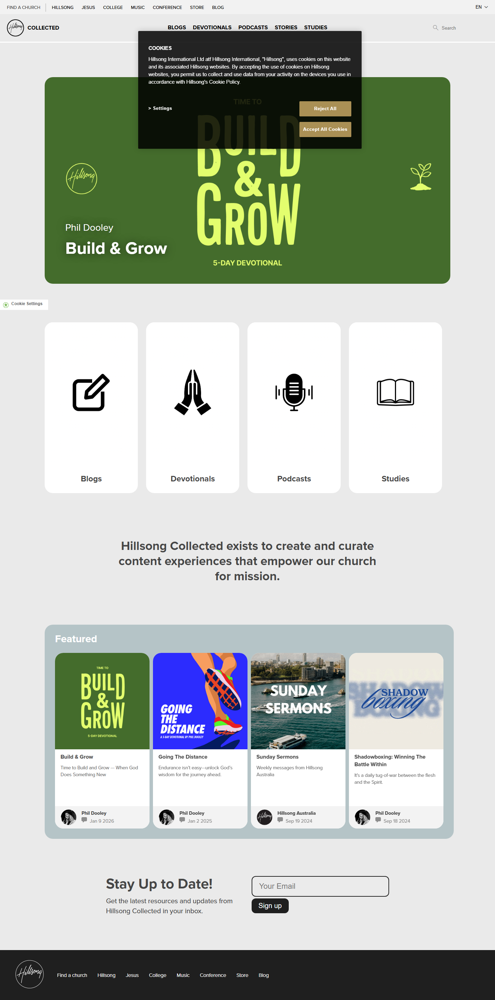


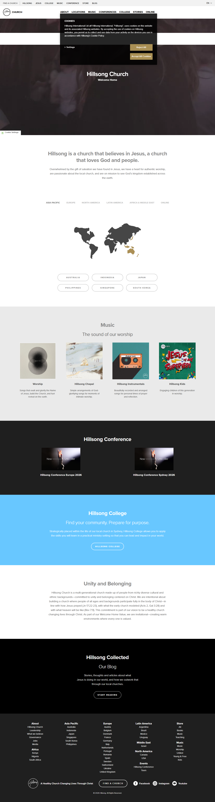

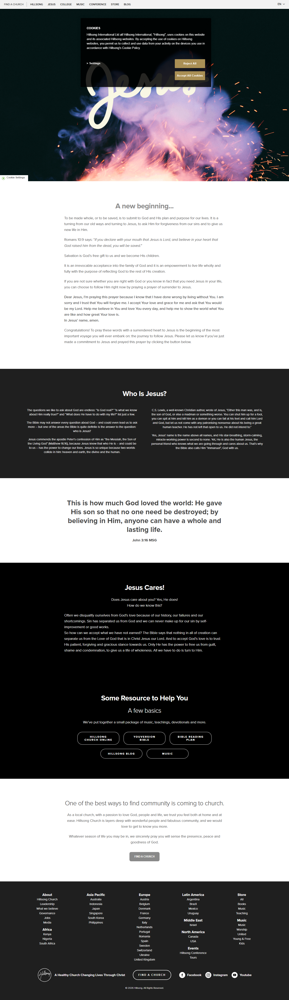

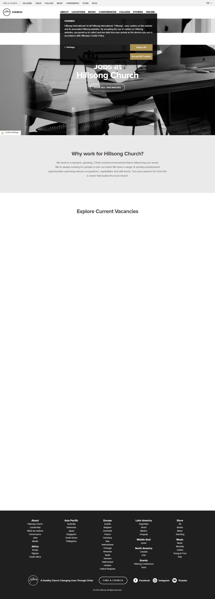

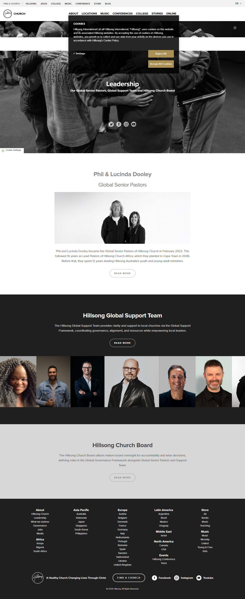

### Section Clips (screens/sections/)

*Clipped individual sections and components*

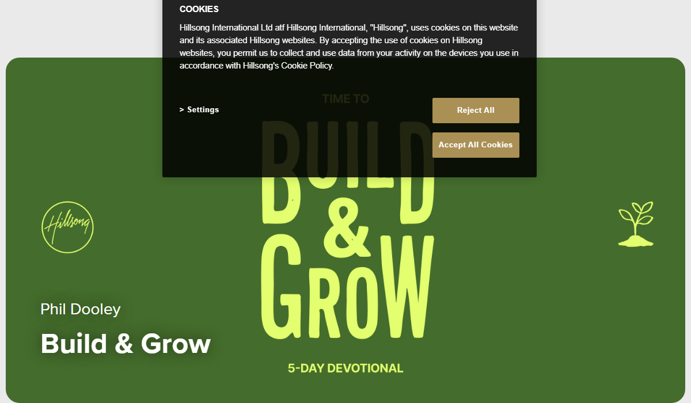


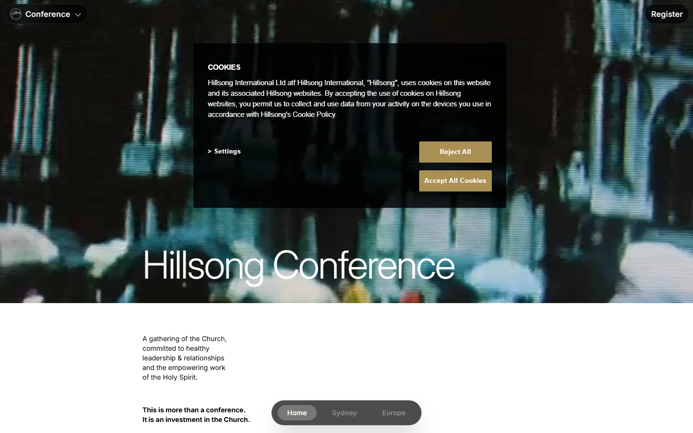

### Interaction States (screens/states/)

*Hover, focus, and active state captures*


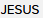

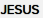


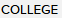


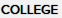

### Screenshot Index (screens/INDEX.md)

# Screenshot Index

## Scroll Journey

> Shows the cinematic state at each point of the page

| Scroll | Y Position | File |
|--------|-----------|------|
| 0% | 0px | `screens/scroll/scroll-000.png` |
| 17% | 755px | `screens/scroll/scroll-017.png` |
| 33% | 1467px | `screens/scroll/scroll-033.png` |
| 50% | 2222px | `screens/scroll/scroll-050.png` |
| 67% | 2977px | `screens/scroll/scroll-067.png` |
| 83% | 3689px | `screens/scroll/scroll-083.png` |
| 100% | 4444px | `screens/scroll/scroll-100.png` |

## Video First Frames

- Video 1 (background): `screens/scroll/video-1-frame.png`

## Pages

| Page | URL | File |
|------|-----|------|
| Hillsong Church - Welcome Home | Church | `https://hillsong.com/` | `screens/pages/home.png` |
| New to Faith? | Jesus | `https://hillsong.com/jesus` | `screens/pages/jesus.png` |
| Hillsong College - Discipling Believers, Raising Leaders | College | `https://hillsong.com/college` | `screens/pages/college.png` |
| Hillsong Conference | Hillsong | `https://hillsong.com/conference` | `screens/pages/conference.png` |
| Collected | Hillsong | `https://hillsong.com/collected` | `screens/pages/collected.png` |
| Leadership | Church | `https://hillsong.com/leadership/` | `screens/pages/leadership.png` |
| Jobs | Church | `https://hillsong.com/jobs/` | `screens/pages/jobs.png` |

## Sections

| Page | Section | File |
|------|---------|------|
| college | #2 ([class*="section"]) | `screens/sections/college-section-2.png` |
| college | #3 ([class*="section"]) | `screens/sections/college-section-3.png` |
| conference | #1 (section) | `screens/sections/conference-section-1.png` |
| conference | #4 ([class*="section"]) | `screens/sections/conference-section-4.png` |
| collected | #1 ([class*="section"]) | `screens/sections/collected-section-1.png` |
| collected | #2 ([class*="section"]) | `screens/sections/collected-section-2.png` |

## Homepage Screenshots (screenshots/)


